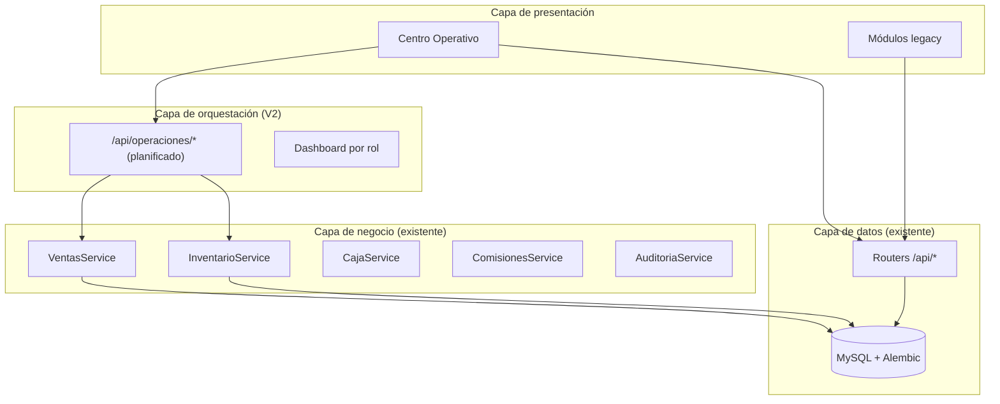

# Arquitectura Operativa V2 — Medina AutoDiag

**Versión:** 1.0  
**Fecha:** Junio 2026  
**Estado:** Documento de referencia arquitectónica  
**Relacionado:** [METODOLOGIA_DESARROLLO_V2.md](./METODOLOGIA_DESARROLLO_V2.md) · [MAPA_FLUJO_OPERATIVO.md](./MAPA_FLUJO_OPERATIVO.md)

---

## 1. Visión

Evolucionar Medina AutoDiag de un **ERP modular** hacia una **plataforma operativa** organizada por los dos procesos reales del taller:

- **Flujo A:** Vehículo en taller (recepción → reparación → cobro → entrega)
- **Flujo B:** Refacción especial (cotización importación → compra → entrega)

Los módulos actuales **no se eliminan**. Se agrega una capa superior: el **Centro Operativo**.

---

## 2. Capas del sistema

---

## 3. Centro Operativo

### 3.1 Concepto

Punto principal de trabajo diario. No reemplaza `/ordenes-trabajo`, `/ventas`, `/caja`, etc.

### 3.2 Superficies operativas

| Ruta propuesta | Componente | Rol | APIs existentes reutilizadas |
|----------------|------------|-----|------------------------------|
| `/operaciones/recepcion` | Recepción Rápida | ADMIN, CAJA, EMPLEADO | `POST /clientes/`, `POST /vehiculos/`, `POST /ordenes-trabajo/` |
| `/operaciones/mi-taller` | Mi Taller | TECNICO, ADMIN | `GET /ordenes-trabajo/` (filtro técnico), acciones OT |
| `/operaciones/caja` | Caja Operativa | ADMIN, CAJA | `/ventas/desde-orden`, `/pagos/`, `/ordenes-trabajo/{id}/entregar`, `/caja/` |
| `/operaciones/refacciones` | Bandeja Flujo B | ADMIN, CAJA, EMPLEADO | `/cotizaciones-refaccion/` |

### 3.3 Router agregador (planificado)

`GET /api/operaciones/resumen?rol=` — compone en una respuesta:

- Citas hoy
- OT por bandeja operativa
- Ventas/OT por cobrar
- Entregas pendientes
- Turno de caja activo

**Regla:** mutaciones delegadas a routers existentes; operaciones solo lee y orquesta en frontend.

---

## 4. Componentes reutilizables

Biblioteca objetivo en `frontend/src/components/operaciones/`:

| Componente | Estado | Prioridad |
|------------|--------|-----------|
| `ClienteAutocompleteConAltaRapida` | ✅ Implementado | Adoptar globalmente |
| `ModalClienteRapido` | ✅ Implementado | — |
| `ModalVehiculoRapido` | ✅ Implementado | — |
| `VehiculoSelectorConAltaRapida` | 🔲 Pendiente | P1 |
| `RecepcionRapidaForm` | 🔲 Pendiente | P1 |
| `ConvertirCitaButton` | 🔲 Pendiente | P2 |
| `EstadoOTBadge` | 🔲 Pendiente | P1 |
| `FlujoCobroModal` | 🔲 Pendiente | P4 |
| `FlujoEntregaModal` | 🔲 Pendiente | P4 |
| `LineasOrdenEditor` | 🔲 Pendiente | P3 |
| `KPIWidget` / `DashboardCard` | 🔲 Pendiente | P5 |

---

## 5. Estados operativos

Mapper de presentación (no cambia enums en BD):

Ver [METODOLOGIA_DESARROLLO_V2.md](./METODOLOGIA_DESARROLLO_V2.md) § Principio 7.

Implementación propuesta: `frontend/src/utils/estadoOperativo.js` + `EstadoOTBadge.jsx`.

---

## 6. Backend — endpoints clave por flujo

### Flujo A

| Paso | Endpoint |
|------|----------|
| Crear OT | `POST /api/ordenes-trabajo/` |
| Cotización PDF | `GET /api/ordenes-trabajo/{id}/cotizacion` |
| Autorizar | `POST /api/ordenes-trabajo/{id}/autorizar` |
| Iniciar (sale stock) | `POST /api/ordenes-trabajo/{id}/iniciar` |
| OC desde OT | `POST /api/ordenes-compra/desde-orden-trabajo/{id}` |
| Finalizar | `POST /api/ordenes-trabajo/{id}/finalizar` |
| Venta desde OT | `POST /api/ventas/desde-orden/{id}` |
| Pago | `POST /api/pagos/` |
| Entregar | `POST /api/ordenes-trabajo/{id}/entregar` |

### Flujo B

| Paso | Endpoint |
|------|----------|
| CRUD cotización | `/api/cotizaciones-refaccion/` |
| PDF | `GET .../{id}/pdf` |
| Comprar | `POST .../registrar-compra` |
| Recibir / Entregar | `POST .../marcar-recibida`, `.../marcar-entregada` |

**Gap P6:** refacción recibida no entra a inventario ni genera venta automática.

### Cita → OT (P2)

Endpoint propuesto: `POST /api/citas/{id}/convertir-orden` (transacción: crear OT + actualizar cita).

---

## 7. Permisos por rol (resumen)

| Acción | ADMIN | CAJA | EMPLEADO | TECNICO |
|--------|-------|------|----------|---------|
| Recepción / crear OT | ✓ | ✓ | ✗ | ✗ |
| Mi Taller / iniciar-finalizar | ✓ | ✗ | ✗ | ✓ (asignadas) |
| Caja operativa | ✓ | ✓ | ✗ | ✗ |
| Crear cliente | ✓ | ✗ | ✓ | ✓ |
| Cotiz. ref. aceptar cliente | ✓ | ✓ | ✓ | ✗ |

Detalle: [ANALISIS_MODULO_ORDENES_TRABAJO.md](./ANALISIS_MODULO_ORDENES_TRABAJO.md) § Permisos.

---

## 8. Roadmap 30-60-90 días

### Días 1–30 (Nivel 1)

- Adoptar autocomplete cliente/vehículo en Citas, Ventas, Cotiz. ref.
- `EstadoOTBadge` en listados OT
- Menú Operaciones + rutas placeholder
- `POST /citas/{id}/convertir-orden`

### Días 31–60 (Nivel 2)

- Recepción Rápida
- Mi Taller
- Caja Operativa + FlujoCobro/Entrega
- Dashboard por rol

### Días 61–90 (Nivel 3)

- Router `/api/operaciones/*`
- `LineasOrdenEditor` unificado
- Integración Flujo B con inventario/venta (con auditoría contable)
- Checklist entrega (km, firma)

---

## 9. Riesgos arquitectónicos

| Riesgo | Mitigación |
|--------|------------|
| Dos entradas confunden usuarios | Menú: Operaciones primero; módulos bajo Administración |
| Lógica duplicada en capa operaciones | Solo agregación; mutaciones en servicios existentes |
| OT sin ítems al crear | Regla: no `iniciar` sin servicios/repuestos |
| Flujo B → inventario sin diseño | P6 separada; revisar [AUDITORIA_CONTABLE.md](./AUDITORIA_CONTABLE.md) |

---

## 10. Referencias

- [METODOLOGIA_DESARROLLO_V2.md](./METODOLOGIA_DESARROLLO_V2.md) — política oficial
- [MAPA_FLUJO_OPERATIVO.md](./MAPA_FLUJO_OPERATIVO.md) — flujos y duplicaciones
- [PLAN_DESIGN_SYSTEM.md](./PLAN_DESIGN_SYSTEM.md) — UI
- [PLAN_COTIZACIONES_REFACCIONES_ESPECIALES.md](./PLAN_COTIZACIONES_REFACCIONES_ESPECIALES.md) — Flujo B
