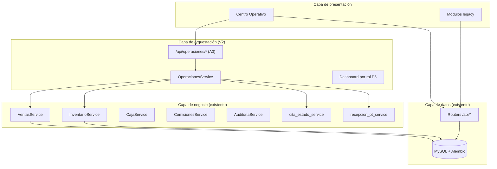

# Arquitectura Operativa V2 — Medina AutoDiag

**Versión:** 1.6  
**Fecha:** Junio 2026  
**Estado:** Documento de referencia arquitectónica  
**Relacionado:** [METODOLOGIA_DESARROLLO_V2.md](./METODOLOGIA_DESARROLLO_V2.md) · [MAPA_FLUJO_OPERATIVO.md](./MAPA_FLUJO_OPERATIVO.md) · [PLAN_P4_CAJA_OPERATIVA.md](./PLAN_P4_CAJA_OPERATIVA.md) · [ADR_P4_0_EVALUADOR_FINANCIERO.md](./ADR_P4_0_EVALUADOR_FINANCIERO.md)

---

## 1. Visión

Evolucionar Medina AutoDiag de un **ERP modular** hacia una **plataforma operativa** organizada por los dos procesos reales del taller:

- **Flujo A:** Vehículo en taller (recepción → reparación → cobro → entrega)
- **Flujo B:** Refacción especial (cotización importación → compra → entrega)

Los módulos actuales **no se eliminan**. Se agrega una capa superior: el **Centro Operativo**.

---

## 2. Capas del sistema



---

## 3. Centro Operativo

### 3.1 Concepto

Punto principal de trabajo diario. No reemplaza `/ordenes-trabajo`, `/ventas`, `/caja`, etc.

### 3.2 Superficies operativas

| Ruta propuesta | Componente | Rol | APIs existentes reutilizadas |
|----------------|------------|-----|------------------------------|
| `/operaciones/recepcion` | Recepción Rápida | ADMIN, CAJA, EMPLEADO | `POST /clientes/`, `POST /vehiculos/`, `POST /ordenes-trabajo/` |
| `/operaciones/mi-taller` | Mi Taller | TECNICO, ADMIN | `GET /operaciones/resumen` (bandejas A0), `POST .../iniciar`, `POST .../finalizar` |
| `/operaciones/caja` | Caja Operativa (Modo Mostrador) | ADMIN, CAJA — **misma UI** | `/operaciones/resumen`, `/ventas/desde-orden`, `/pagos/`, `/ordenes-trabajo/{id}/entregar`; turno en `/caja/` |
| `/operaciones/refacciones` | Bandeja Flujo B | ADMIN, CAJA, EMPLEADO | `/cotizaciones-refaccion/` |

### 3.3 Capa Operativa Central — Hito A0

**Estado:** ✅ **Cerrado en producción** (A0 v1) — **P4.0 extiende a A0 v2** (pendiente implementación)  
**Plan:** [PLAN_A0_CAPA_OPERATIVA_CENTRAL.md](./PLAN_A0_CAPA_OPERATIVA_CENTRAL.md)  
**Extensión P4.0:** [ADR_P4_0_EVALUADOR_FINANCIERO.md](./ADR_P4_0_EVALUADOR_FINANCIERO.md) — `meta.version_contrato = "a0-v2"`

`GET /api/operaciones/resumen` — diagnóstico consolidado (solo lectura):

| Bandeja | Contenido |
|---------|-----------|
| `citas_pendientes_marcacion` | CONFIRMADA con hora pasada, sin marcación |
| `citas_convertibles` | CONFIRMADA/SI_ASISTIO sin OT |
| `ot_pendientes` | PENDIENTE, COTIZADA, ESPERANDO_* |
| `ot_en_proceso` | EN_PROCESO |
| `ot_completadas` | COMPLETADA recientes (solo lectura; P3.1 Mi Taller) |
| `ot_pendientes_cobro` | COMPLETADA sin venta pagada |
| `ot_listas_entrega` | COMPLETADA + venta saldada |
| `ventas_saldo_pendiente` | Ventas con saldo > 0 (post-P4.0: excluye ventas OT ya en `ot_pendientes_cobro`) |
| `alertas_operativas` | Caja, inventario, citas vencidas |

Incluye `acciones_globales` y `acciones` por ítem (`permitida`, `motivo_bloqueo`).

**Servicio:** `OperacionesService` en `app/services/operaciones_service.py`.

**Reglas A0:**

- Mutaciones **delegadas** a routers existentes (`/citas`, `/ordenes-trabajo`, `/ventas`, `/pagos`).
- `/api/operaciones/*` **no escribe** en BD.
- Complementa (no reemplaza) `GET /api/dashboard` (finanzas/KPIs).
- Sin migración Alembic.

**Consumidores:**

| Hito | Uso de A0 | Estado |
|------|-----------|--------|
| P3.1 Mi Taller | Bandejas `ot_pendientes`, `ot_en_proceso`, `ot_completadas`; acciones `iniciar_ot` / `finalizar_ot` | ✅ Prod (Jun 2026) |
| P4 Caja Operativa | Cobro + entrega desde A0; P4.0 extiende evaluador; P4.3 bloqueo financiero | 📋 Plan aprobado — ver [PLAN_P4_CAJA_OPERATIVA.md](./PLAN_P4_CAJA_OPERATIVA.md) |
| P5 Dashboard por rol | `metricas` + `alertas_operativas` | 🔲 Pendiente |
| P6 Refacción automática | Contadores Flujo B extensibles | 🔲 Pendiente |

### 3.4 Evaluador de acciones OT — PREREQ P3

**Estado:** ✅ **CERRADO EN PRODUCCIÓN** (Jun 2026)  
**Servicio:** `app/services/ot_acciones_service.py`

| Hito | Commit | Notas |
|------|--------|-------|
| PREREQ evaluador central | `39c7102` | `Backend == A0 == acciones[]` |
| Fix bandejas financieras A0 | `d7992e0` | `usuario` en `pendientes_cobro` / `listas_entrega` |
| Cross-check E2E pre-deploy | — | **7/7 PASS** (Railway MySQL, rollback) |
| Smoke post-deploy prod | — | Health, A0, detalle `acciones[]`, Citas/Recepción/CAJA OK |
| **P3.1 Mi Taller** | `658a3a2` | Deploy Railway `9dee9714`; validación operativa prod — ver [CIERRE_P3_1_MI_TALLER.md](./CIERRE_P3_1_MI_TALLER.md) |

### 3.5 P3.1 Mi Taller — CERRADO EN PRODUCCIÓN

**Estado:** ✅ **CERRADO EN PRODUCCIÓN** (Jun 2026) — validado operativamente  
**Commit:** `658a3a2` — feat: add mi taller operative view  
**Cierre:** [CIERRE_P3_1_MI_TALLER.md](./CIERRE_P3_1_MI_TALLER.md)

- Ruta: `/operaciones/mi-taller` (alias `/mi-taller` → redirect)
- Roles: TECNICO (OT propias), ADMIN (global + nombre técnico en tarjetas)
- Frontend: `MiTaller.jsx`, `BandejaOtSection`, `OtOperativaCard`, `AccionesOtRenderer`, hook `useOperacionesResumen`
- Botones **solo** desde `acciones[]` por ítem (prohibido decidir por `estado`/`rol` local)
- Bandeja A0: `ot_completadas` (métrica homónima; `acciones = []`)
- Sin Alembic en P3.1

**Alcance validado en prod:** bandejas A0, acciones OT, iniciar/finalizar, refetch React Query, filtro por técnico, completadas solo lectura.

**Fuera de alcance P3.1 (backlog):** pausar/reanudar refacción, cronómetros, asignación técnico, bandeja sin asignar, Caja Operativa (P4). Hallazgos P3-UX-001..006, OT-FECHAS-V1 y OT-UX-001 documentados en [CIERRE_P3_1_MI_TALLER.md](./CIERRE_P3_1_MI_TALLER.md).

**Modos Mi Taller (P3.2):** Modo Supervisor (ADMIN) vs Modo Operativo (TECNICO) — ver P3-UX-006 en cierre P3.1.

**Roadmap acordado post-P3.1:** ver [PLAN_P4_CAJA_OPERATIVA.md](./PLAN_P4_CAJA_OPERATIVA.md) §8 (OT-FECHAS-V1 → P4.0 → P4.1 → …).

Fuente única de verdad para que **Backend == A0 == acciones[]**:

| Consumidor | Uso |
|------------|-----|
| `OperacionesService` (A0) | `acciones[]` por ítem en bandejas OT |
| `GET /api/ordenes-trabajo/{id}` | Campo opcional `acciones[]` en detalle |
| `POST` mutaciones OT (`acciones.py`) | `asegurar_accion_ot_permitida()` antes de ejecutar |

Cada acción evaluada expone `permitida`, `motivo_bloqueo` y `codigo_bloqueo` (p. ej. `SIN_ITEMS`, `ESTADO_INVALIDO`, `SIN_TECNICO`).

**DEPRECADO — compatibilidad temporal**

```python
ALLOW_TECNICO_SELF_ASSIGN = True  # app/services/ot_acciones_service.py
```

Mientras esté activo, un **TECNICO** puede iniciar una OT **sin** `tecnico_id` previo (auto-asignación implícita al iniciar). Refleja el comportamiento histórico del backend para evitar regresiones antes de Mi Taller.

**Plan futuro (D1 — asignación obligatoria)**

Mi Taller ya está desplegado en producción (P3.1). Próximo paso cuando el negocio lo apruebe:

1. `ALLOW_TECNICO_SELF_ASSIGN = False`
2. Eliminar definitivamente la auto-asignación de técnico en el handler de `iniciar`

Hasta entonces, no eliminar auto-assign en mutaciones OT.

**Fuera de alcance en PREREQ evaluador:** pausar/reanudar refacción, cambios de estados OT, Recepción, Citas.

**Pendiente P4.0 (extensión A0 v2 — ADR aprobado):** [ADR_P4_0_EVALUADOR_FINANCIERO.md](./ADR_P4_0_EVALUADOR_FINANCIERO.md)

- `acciones_operativas_service` — evaluador financiero-operativo
- `registrar_pago` en `acciones[]` por ítem; **nunca** `permitida=true` en `acciones_globales`
- Deduplicación dominio bandejas financieras (no frontend)
- Sin cambios a comisiones, VentasService core, pagos core, Alembic
- **P4.1 UI bloqueada** hasta P4.0 validado

### 3.6 P4 Caja Operativa — PLAN APROBADO

**Estado:** 📋 **Plan arquitectónico aprobado** — P4.0 ADR aprobado; pendiente implementación  
**Plan:** [PLAN_P4_CAJA_OPERATIVA.md](./PLAN_P4_CAJA_OPERATIVA.md)  
**ADR P4.0:** [ADR_P4_0_EVALUADOR_FINANCIERO.md](./ADR_P4_0_EVALUADOR_FINANCIERO.md) — fuente normativa implementación

**Naturaleza:** superficie operativa de **mostrador** (cobrar, confirmar pagos, entregar). **No** es módulo financiero — no reemplaza `/ventas`, `/caja` ni reportería.

**Modo Mostrador:** ADMIN y CAJA ven la **misma interfaz** en `/operaciones/caja`; bandejas técnicas permanecen en Mi Taller.

**Sub-hitos aprobados:**

1. HOTFIX OT-FECHAS-V1 (dependencia crítica prod P4)
2. P4.0 Evaluador Financiero — **A0 v2** + `acciones_operativas_service` (ADR aprobado)
3. P4.1 Caja Operativa MVP — **bloqueado** hasta P4.0 validado
4. P4.2 Flujo guiado (modales)
5. P4.3 Bloqueo financiero (futuro; posible Alembic)

**Invariante dominio:** una OT no aparece en dos bandejas del mismo paso financiero; deduplicación en `OperacionesService`, no en frontend.

**Restricción comisiones:** P4 no modifica cálculo, disparo, reglas ni persistencia de comisiones en ninguna fase.

**Prod P4.1:** requiere OT-FECHAS-V1 + P4.0 (`a0-v2`) validado; prohibido desplegar si A0 muestra acción permitida que el backend rechaza. **UI P4.1 no inicia** hasta P4.0 cerrado (ADR §6).

---

## 4. Componentes reutilizables

Biblioteca objetivo en `frontend/src/components/operaciones/`:

| Componente | Estado | Prioridad |
|------------|--------|-----------|
| `ClienteAutocompleteConAltaRapida` | ✅ Implementado | **Adoptado** en Citas, Ventas, Cotizaciones, OT, Recepción |
| `ModalClienteRapido` | ✅ Implementado | Integrado vía autocomplete |
| `ModalVehiculoRapido` | ✅ Implementado | Integrado vía selector |
| `VehiculoSelectorConAltaRapida` | ✅ Implementado | **Adoptado** en Citas, Ventas, OT, Recepción |
| `RecepcionRapidaForm` | ✅ Implementado | P1 cerrado |
| `BandejaOtSection` | ✅ Implementado | P3.1 Mi Taller |
| `OtOperativaCard` | ✅ Implementado | P3.1 Mi Taller |
| `AccionesOtRenderer` | ✅ Implementado | P3.1 — gobernado por `acciones[]` |
| `EstadoOTBadge` | ✅ Implementado | Listado OT, Mi Taller |
| `ConvertirCitaButton` | ✅ Integrado en Citas.jsx | P2 cerrado |
| `CajaOperativa.jsx` | 🔲 Pendiente | P4.1 |
| `TurnoCajaBanner` | 🔲 Pendiente | P4.1 |
| `AccionesCajaRenderer` | 🔲 Pendiente | P4.1 |
| `BandejaVentaSection` | 🔲 Pendiente | P4.1 |
| `FlujoCobroModal` | 🔲 Pendiente | P4.2 |
| `FlujoEntregaModal` | 🔲 Pendiente | P4.2 |
| `LineasOrdenEditor` | 🔲 Pendiente | P3 |
| `KPIWidget` / `DashboardCard` | 🔲 Pendiente | P5 |

---

## 5. Estados operativos

Mapper de presentación (no cambia enums en BD):

Ver [METODOLOGIA_DESARROLLO_V2.md](./METODOLOGIA_DESARROLLO_V2.md) § Principio 7.

Implementación propuesta: `frontend/src/utils/estadoOperativo.js` + `EstadoOTBadge.jsx`.

---

## 6. Backend — endpoints clave por flujo

### Flujo A

| Paso | Endpoint |
|------|----------|
| Crear OT | `POST /api/ordenes-trabajo/` |
| Cotización PDF | `GET /api/ordenes-trabajo/{id}/cotizacion` |
| Autorizar | `POST /api/ordenes-trabajo/{id}/autorizar` |
| Iniciar (sale stock) | `POST /api/ordenes-trabajo/{id}/iniciar` |
| OC desde OT | `POST /api/ordenes-compra/desde-orden-trabajo/{id}` |
| Finalizar | `POST /api/ordenes-trabajo/{id}/finalizar` |
| Venta desde OT | `POST /api/ventas/desde-orden/{id}` |
| Pago | `POST /api/pagos/` |
| Entregar | `POST /api/ordenes-trabajo/{id}/entregar` |

### Flujo B

| Paso | Endpoint |
|------|----------|
| CRUD cotización | `/api/cotizaciones-refaccion/` |
| PDF | `GET .../{id}/pdf` |
| Comprar | `POST .../registrar-compra` |
| Recibir / Entregar | `POST .../marcar-recibida`, `.../marcar-entregada` |

**Regla de reutilización (Jun 2026):** ver [METODOLOGIA_DESARROLLO_V2.md](./METODOLOGIA_DESARROLLO_V2.md) § Directiva obligatoria — no navegar a módulos maestros durante flujos operativos.

**PRE-CHECK arquitectónico (Jun 2026):** toda tarea relevante requiere checklist + reporte antes de implementar — ver [METODOLOGIA_DESARROLLO_V2.md](./METODOLOGIA_DESARROLLO_V2.md) § PRE-CHECK ARQUITECTÓNICO OBLIGATORIO y regla Cursor `pre-check-arquitectonico.mdc`.

**Gap P6:** refacción recibida no entra a inventario ni genera venta automática.

### Cita → OT (P2 — implementado)

`POST /api/citas/{id}/convertir-orden` — transacción: crear OT PENDIENTE + vincular cita. Citas sin vehículo → recepción rápida con `?cita_id=`.

---

## 7. Permisos por rol (resumen)

| Acción | ADMIN | CAJA | EMPLEADO | TECNICO |
|--------|-------|------|----------|---------|
| Recepción / crear OT | ✓ | ✓ | ✗ | ✗ |
| Mi Taller / iniciar-finalizar | ✓ | ✗ | ✗ | ✓ (asignadas) |
| Caja operativa | ✓ | ✓ | ✗ | ✗ |
| Alta rápida cliente (flujos operativos) | ✓ | ✓ | ✓ | ✗ |
| Admin. maestra cliente (editar/eliminar) | ✓ | ✗ | ✓ | ✓ |
| Cotiz. ref. aceptar cliente | ✓ | ✓ | ✓ | ✗ |

**Alta rápida operativa:** `POST /api/clientes/` desde Citas, Recepción, Ventas, Cotizaciones, OT — roles `ADMIN`, `CAJA`, `EMPLEADO`. Constante frontend: `ROLES_ALTA_RAPIDA_CLIENTE`.

**Administración maestra:** edición (`PUT`), eliminación (`DELETE`), historial — sin cambios; CAJA no edita/elimina clientes.

Detalle: [ANALISIS_MODULO_ORDENES_TRABAJO.md](./ANALISIS_MODULO_ORDENES_TRABAJO.md) § Permisos.

---

## 8. Roadmap 30-60-90 días

### Cerrado ✅

- P1 Recepción Rápida V2
- P2 Cita → OT V2 + estados gobernados (Citas Fase 1–2 en prod)
- Autocomplete cliente/vehículo adoptado en flujos clave
- `EstadoOTBadge`, `ConvertirCitaButton`
- P3.1 Mi Taller — **cerrado en producción** (`658a3a2`; validación OT-20260610-0001) — ver [CIERRE_P3_1_MI_TALLER.md](./CIERRE_P3_1_MI_TALLER.md)

### A0 — Capa Operativa Central ✅

- `OperacionesService` + `GET /api/operaciones/resumen`
- Contrato con acciones por rol
- Tests backend (unit + integration)
- Ver [PLAN_A0_CAPA_OPERATIVA_CENTRAL.md](./PLAN_A0_CAPA_OPERATIVA_CENTRAL.md)

### Días 31–60 (Nivel 2 — tras A0)

Ver [PLAN_P4_CAJA_OPERATIVA.md](./PLAN_P4_CAJA_OPERATIVA.md):

1. HOTFIX OT-FECHAS-V1 (dependencia crítica prod P4)
2. P4.0 Evaluador Financiero (extensión A0)
3. P4.1 Caja Operativa MVP
4. P4.2 Flujo guiado (modales)
5. P4.3 Bloqueo financiero (futuro)
6. P3.2+ Mi Taller (UX P3-UX-001..006)
7. P5 Dashboard por rol (consume A0)

### Días 61–90 (Nivel 3)

- P6 Integración Flujo B → inventario/venta
- `LineasOrdenEditor` unificado
- Checklist entrega (km, firma)
- Citas Fase 3 reportes + Fase 4 bloqueo financiero

---

## 9. Riesgos arquitectónicos

| Riesgo | Mitigación |
|--------|------------|
| Dos entradas confunden usuarios | Menú: Operaciones primero; módulos bajo Administración |
| Lógica duplicada en capa operaciones | Solo agregación; `OperacionesService` reutiliza `recepcion_ot_service` y `cita_estado_service` |
| Dos dashboards confusos (`/dashboard` vs `/operaciones`) | Documentar: finanzas vs bandejas operativas; nombres de bandeja explícitos |
| OT sin ítems al crear | Regla: no `iniciar` sin servicios/repuestos; backlog métricas P5 (OT con `SIN_ITEMS`) |
| Fechas OT timezone (`OT-FECHAS-V1`) | Dependencia crítica prod P4; ver [PLAN_P4_CAJA_OPERATIVA.md](./PLAN_P4_CAJA_OPERATIVA.md) |
| `registrar_pago` fuera del Evaluador Central | P4.0 ADR — `acciones_operativas_service` + A0 v2 |
| Duplicidad `ot_pendientes_cobro` / `ventas_saldo_pendiente` | Invariante dominio en P4.0; no deduplicar solo en UI |
| Desalineación futura evaluador vs APIs operativas (R10) | Toda mutación OT/financiera operativa → Evaluador Central primero |
| P4 absorbe Ventas/Caja legacy | Contención explícita: Caja Operativa = mostrador, no módulo financiero |
| Flujo B → inventario sin diseño | P6 separada; revisar [AUDITORIA_CONTABLE.md](./AUDITORIA_CONTABLE.md) |

---

## 10. Referencias

- [METODOLOGIA_DESARROLLO_V2.md](./METODOLOGIA_DESARROLLO_V2.md) — política oficial
- [CIERRE_P3_1_MI_TALLER.md](./CIERRE_P3_1_MI_TALLER.md) — cierre validación Mi Taller en producción
- [PLAN_P4_CAJA_OPERATIVA.md](./PLAN_P4_CAJA_OPERATIVA.md) — plan arquitectónico Caja Operativa (aprobado)
- [ADR_P4_0_EVALUADOR_FINANCIERO.md](./ADR_P4_0_EVALUADOR_FINANCIERO.md) — ADR aprobado P4.0 / contrato A0 v2
- [MAPA_FLUJO_OPERATIVO.md](./MAPA_FLUJO_OPERATIVO.md) — flujos y duplicaciones
- [PLAN_DESIGN_SYSTEM.md](./PLAN_DESIGN_SYSTEM.md) — UI
- [PLAN_COTIZACIONES_REFACCIONES_ESPECIALES.md](./PLAN_COTIZACIONES_REFACCIONES_ESPECIALES.md) — Flujo B
