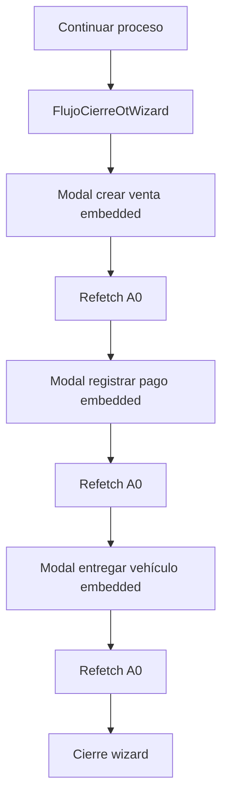

# Cierre P4.2 — Flujo Guiado Caja Operativa (Fase 1)

**Versión:** 1.0  
**Fecha:** 12 de junio de 2026  
**Estado:** ✅ **CONGELADO** — punto de partida para P5 u otras fases  
**Entorno producción:** `https://medinaautodiag.up.railway.app`  
**Contrato vigente:** A0 v2 (`meta.version_contrato = "a0-v2"`)  
**SHA `main` al cierre:** `8fa5c42` — `test(p4.2): alinear seeds con saldo real y O2`

**Referencias (sin modificar en este hito):**

- [CIERRE_RELEASE_P41_CAJA_OPERATIVA.md](./CIERRE_RELEASE_P41_CAJA_OPERATIVA.md)
- [ADR_P4_0_EVALUADOR_FINANCIERO.md](./ADR_P4_0_EVALUADOR_FINANCIERO.md)
- [ARQUITECTURA_OPERATIVA_V2.md](./ARQUITECTURA_OPERATIVA_V2.md)

---

## 1. Resumen ejecutivo

P4.2 Fase 1 agrega un **flujo guiado** sobre la Caja Operativa P4.1: un CTA único **«Continuar proceso»** que orquesta los modales existentes (crear venta → registrar pago → entregar vehículo) con **refetch obligatorio de A0** entre pasos. No introduce reglas de negocio nuevas ni cambia backend, evaluadores ni contrato A0.

El hito quedó desplegado en producción sobre `8fa5c42`, con CI Run **#315** verde, Railway auto-deploy success y smoke de producción **PASS** (solo lectura).

| Hito | Estado al cierre |
|------|------------------|
| P4.0 Evaluador Financiero / A0 v2 | ✅ Vigente (sin cambios) |
| P4.1 Caja Operativa UI | ✅ Base intacta |
| P4.2 Flujo guiado (Fase 1) | ✅ Cerrado y desplegado |
| GitHub Actions CI | ✅ Verde (Run #315) |
| Railway auto-deploy | ✅ Success |
| Smoke producción (solo lectura) | ✅ PASS |
| Playwright E2E Caja / wizard | 🔲 Fuera de alcance |

**Principio arquitectónico preservado:**

```text
Backend == A0 == acciones[] == UI
```

El wizard **lee** `acciones[]` del ítem; las mutaciones siguen vía `accionesCajaApi.js` y endpoints P4.1.

---

## 2. Alcance implementado

### 2.1 Entregables P4.2 Fase 1

| Componente | Ubicación | Función |
|------------|-----------|---------|
| Resolución de pasos desde A0 | `frontend/src/utils/flujoCajaPasos.js` | `primerPasoPermitido`, `siguientePasoPermitido`, `buscarItemEnBandejas`, CTA `Continuar proceso` |
| Wizard multi-paso | `frontend/src/components/operaciones/FlujoCierreOtWizard.jsx` | Orquesta modales P4.1 en modo `embedded`; refetch A0 tras cada mutación |
| CTA + fallback | `frontend/src/components/operaciones/AccionesCajaRenderer.jsx` | Botón «Continuar proceso» + enlace «Acciones individuales» |
| Orquestación | `frontend/src/pages/operaciones/CajaOperativa.jsx` | Estado del wizard, `refetchA0Data()`, modales P4.1 |
| Modales P4.1 (embedded) | `FlujoCrearVentaOtModal`, `FlujoRegistrarPagoModal`, `FlujoEntregarVehiculoModal` | Prop `embedded` para uso dentro del wizard |
| Tests integración API | `tests/test_p42_flujo_guiado_caja.py` | Golden path encadenado + escenarios O1/O2/turno (4 tests) |

### 2.2 Fuera de alcance (explícito)

- Cambios en `app/services/acciones_operativas_service.py` (evaluadores P4.0).
- Cambios en `app/services/operaciones_service.py` (A0 v2).
- Cambios en `frontend/src/services/accionesCajaApi.js`.
- Playwright / E2E navegador.
- P4.3, P5 Dashboard u otras fases.

### 2.3 Superficie operativa

Ruta sin cambios: **`/operaciones/caja`** — roles **ADMIN** y **CAJA**.

Bandejas afectadas por el wizard (mismas que P4.1):

| Bandeja | Clave A0 | Pasos wizard posibles |
|---------|----------|------------------------|
| O1 — Por cobrar | `ot_pendientes_cobro` | crear venta → pago |
| O2 — Listas entrega | `ot_listas_entrega` | entregar vehículo |
| V1 — Ventas saldo | `ventas_saldo_pendiente` | registrar pago |

---

## 3. Commits

| SHA | Mensaje | Alcance |
|-----|---------|---------|
| `82ea5c4` | `feat(p4.2): agregar flujo guiado en caja operativa` | Frontend wizard + tests P4.2 (8 archivos, +783 / −59 líneas) |
| `8fa5c42` | `test(p4.2): alinear seeds con saldo real y O2` | Hotfix tests: seeds con liquidación real vía `POST /api/pagos/`; saldo dinámico sin hardcode IVA |

**Cadena de release:** `82ea5c4` (feature) → CI #314 falló en tests → `8fa5c42` (hotfix tests) → CI #315 verde → Railway success.

---

## 4. Arquitectura

### 4.1 CTA «Continuar proceso»

- Constante `CTA_FLUJO_CAJA` en `flujoCajaPasos.js`.
- Visible solo si `hayAccionCajaPermitida(acciones)` — al menos una acción caja (`crear_venta_desde_ot`, `registrar_pago`, `entregar_vehiculo`) con `permitida === true` en el ítem A0.
- Si ninguna acción está permitida, se muestran chips de bloqueo (motivo A0), sin CTA.

### 4.2 Wizard frontend (`FlujoCierreOtWizard`)



- **Primer paso:** `primerPasoPermitido(item.acciones)` — orden canónico: crear venta → pago → entrega.
- **Siguiente paso:** `siguientePasoPermitido(acciones, pasoActual)` tras refetch.
- **Ítem actualizado:** `buscarItemEnBandejas(bandejas, itemRef)` localiza el ítem en O1/O2/V1 post-mutación.
- **Mutaciones:** mismos handlers y `accionesCajaApi.js` que P4.1; el wizard no llama endpoints directamente.

### 4.3 Refetch A0 entre pasos

- `CajaOperativa.refetchA0Data()` invalida query y ejecuta `refetch()` de `useOperacionesResumen`.
- Obligatorio tras cada POST exitoso antes de avanzar o cerrar el wizard.
- Evita desincronización entre saldo, bandeja (O1→O2) y `acciones[]`.

### 4.4 Fallback «Acciones individuales»

- Enlace bajo el CTA cuando hay al menos una acción permitida.
- Despliega los botones P4.1 originales (crear venta, registrar pago, entregar).
- Permite operación granular sin entrar al wizard; mismas reglas A0 en cada botón.

### 4.5 Sin cambios backend / A0 / evaluadores

| Capa | Estado en P4.2 |
|------|----------------|
| `acciones_operativas_service.py` | Sin cambios |
| `operaciones_service.py` (A0 v2) | Sin cambios |
| Endpoints POST existentes | Sin cambios |
| `accionesCajaApi.js` | Sin cambios |

---

## 5. Validaciones

### 5.1 Local / CI

| Validación | Resultado |
|------------|-----------|
| `pytest tests/` | **185 passed** |
| `tests/test_p42_flujo_guiado_caja.py` | **4 passed** |
| P4.1 + P4.2 (`test_p41_*` + `test_p42_*`) | **11 passed** |
| `ruff check app tests` | OK |
| `black --check app tests` | OK |
| `npm run build` (frontend) | OK |

### 5.2 CI Run #315

| Job | Resultado |
|-----|-----------|
| lint | ✅ success |
| build-frontend | ✅ success |
| test | ✅ success |

URL: https://github.com/RamonRabago/medina_autodiag/actions/runs/27434422462

### 5.3 Producción (smoke solo lectura — 12 jun 2026)

| Check | Evidencia |
|-------|-----------|
| Health | `GET /health` → 200, `healthy`, BD conectada |
| SHA desplegado | `GET /api/config` → `build_rev: 8fa5c42754b9` |
| Bundle P4.2 | Chunk lazy `CajaOperativa-DmQxaj5D.js` con «Continuar proceso», «Acciones individuales», pasos wizard |
| A0 v2 | `version_contrato: a0-v2` (CAJA y ADMIN) |
| Escenarios observables (GET) | O1: 3 OT con `crear_venta_desde_ot` permitida; O2: 2 OT con `entregar_vehiculo` permitida; V1: 2 ventas con saldo; turno por usuario coherente con A0 |

**Veredicto smoke:** **PASS** (solo lectura; sin POST en producción).

---

## 6. Riesgos residuales

| Riesgo | Impacto | Mitigación sugerida |
|--------|---------|-------------------|
| **UI autenticada no validada visualmente** | Bajo–medio | Walkthrough manual con usuario CAJA en `/operaciones/caja` |
| **Turno de caja por usuario** | Medio operativo | El evaluador exige turno **del usuario logueado**; si ADMIN tiene turno abierto, CAJA ve `TURNO_CERRADO` en V1 y wizard bloqueado en pagos | Procedimiento operativo: turno abierto por el cajero que cobra |
| **Chunk lazy CajaOperativa** | Bajo | Primera carga de la ruta descarga chunk adicional; delay breve aceptable |
| **Playwright fuera de alcance** | Medio a largo plazo | E2E automatizado pendiente para wizard + fallback |
| **Hotfix tests post-release** | Resuelto | CI #314 falló por seeds incorrectos; corregido en `8fa5c42` sin bug productivo |

---

## 7. Recomendación siguiente

1. **Walkthrough UI con usuario CAJA** (15 min, puede ser solo lectura hasta confirmar CTA y fallback):
   - Login CAJA con **turno propio abierto**.
   - Verificar «Continuar proceso» en O1 y O2.
   - Expandir «Acciones individuales» y confirmar modales P4.1.
   - Opcional: ejecutar un flujo real en ventana controlada si el negocio lo autoriza.

2. **PRE-CHECK P5 Dashboard por rol** antes de implementar:
   - Revisar [ARQUITECTURA_OPERATIVA_V2.md](./ARQUITECTURA_OPERATIVA_V2.md) y contrato A0.
   - Confirmar que P5 no duplique bandejas ni evalúe permisos en frontend.
   - No iniciar P5 hasta cerrar walkthrough UI si el negocio lo exige como gate.

---

## Anexo — Tests P4.2

| Test | Qué valida |
|------|------------|
| `test_p42_golden_path_crear_venta_pago_total_entregar` | O1 → venta → pago total → O2 → entregar |
| `test_p42_pago_parcial_detiene_flujo_con_saldo` | Pago parcial mantiene O1; entrega no permitida |
| `test_p42_sin_turno_bloquea_pago_tras_crear_venta` | A0 bloquea `registrar_pago` con `TURNO_CERRADO` |
| `test_p42_o2_solo_entrega_permitida` | OT liquidada en O2; solo entrega verde |

---

*Documento de cierre P4.2 Fase 1. No modifica docs maestros; actualización de METODOLOGIA / PLAN global queda para hito posterior.*
