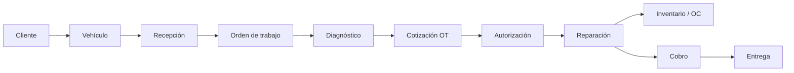

# Mapa de Flujo Operativo — Medina AutoDiag

**Versión:** 1.0  
**Fecha:** Junio 2026  
**Estado:** Documento de referencia  
**Relacionado:** [METODOLOGIA_DESARROLLO_V2.md](./METODOLOGIA_DESARROLLO_V2.md) · [ARQUITECTURA_OPERATIVA_V2.md](./ARQUITECTURA_OPERATIVA_V2.md)

---

## 1. Flujos principales

### 1.1 Flujo A — Vehículo en taller

**Pantallas actuales involucradas:**

| Paso | Pantalla / ruta | Rol |
|------|-----------------|-----|
| Cliente/Vehículo | `/ordenes-trabajo/nueva`, `/clientes`, `/vehiculos` | Recepción |
| OT | `/ordenes-trabajo`, `/ordenes-trabajo/:id` | Todos |
| Cotización | PDF desde OT listado/detalle | Técnico, Caja |
| Reparación | Detalle OT, Mi Taller (planificado) | Técnico |
| OC / Inventario | `/ordenes-compra`, `/inventario` | Caja, Admin |
| Cobro | `/ventas` | Caja |
| Entrega | Botón en OT listado/detalle | Caja |

### 1.2 Flujo B — Refacción especial

**Pantallas:** `/cotizaciones-refaccion`, `/cotizaciones-refaccion/:id`

**Gap:** no conecta automáticamente con inventario, venta ni OT (P6 roadmap).

---

## 2. Flujos secundarios (soporte)

| Flujo | Módulos | Cuándo |
|-------|---------|--------|
| Cita programada | `/citas` | Antes de llegada |
| Compra local | `/ordenes-compra`, `/proveedores` | Repuesto en mercado local |
| Entrada inventario | `/inventario`, `/inventario/entrada/:id` | Recepción mercancía OC |
| Devolución | `/devoluciones` | Cancelación venta/OT |
| Caja / turno | `/caja`, `/gastos` | Apertura/cierre día |
| CxP | `/cuentas-por-pagar` | Pago proveedores |
| Comisiones | Automático al pagar venta | Post-cobro |
| Nómina / RH | `/mi-nomina`, `/asistencia`, `/vacaciones` | RRHH |

---

## 3. Customer Journey

### Flujo A — Perspectiva del cliente

1. **Contacto:** llama, WhatsApp o walk-in
2. **Llegada:** recepción identifica o registra
3. **Diagnóstico:** técnico revisa; cotización enviada
4. **Decisión:** autoriza monto o rechaza
5. **Espera:** reparación; posible espera de piezas
6. **Cierre:** aviso de listo, pago, entrega de vehículo

### Puntos de fricción actuales

| Fricción | Causa | Solución V2 |
|----------|-------|-------------|
| Repetir motivo | Cita no convierte a OT | P2: Convertir a OT |
| Repetir cliente/vehículo | Formularios duplicados | P1: componentes universales |
| Espera en mostrador | Cobro y entrega en pantallas distintas | P4: Caja Operativa |
| No sabe estado del auto | Estados técnicos opacos | EstadoOTBadge operativo |

---

## 4. Duplicaciones detectadas

### 4.1 Pantallas y formularios

| Entidad | Implementaciones | Archivos |
|---------|-------------------|----------|
| Alta cliente | 4+ | `Clientes.jsx`, `ModalClienteRapido`, `Citas.jsx`, `Ventas.jsx`, `CotizacionesRefaccion.jsx` |
| Alta vehículo cliente | 5 | `ModalVehiculoRapido`, `Clientes`, `Vehiculos`, `Citas`, OT |
| Alta vehículo catálogo | 2 | `NuevaOrdenCompra`, `EditarOrdenCompra` |
| Edición OT | 3 entradas | Modal listado, `?edit=id`, detalle |
| OC crear/editar | 2 páginas | `NuevaOrdenCompra`, `EditarOrdenCompra` |
| Líneas servicio/repuesto | 3 | Wizard OT, modal edición OT, modal Ventas |

### 4.2 Procesos duplicados

| Proceso | Ocurrencias |
|---------|-------------|
| Cotización | OT PDF vs Cotización refacción especial |
| Alertas | 6 endpoints (`/notificaciones`, `/caja/alertas`, `/inventario/alertas`, etc.) |
| Dashboard KPIs | `/dashboard`, `/ordenes-trabajo/estadisticas`, `/inventario/reportes/dashboard` |
| Productos más vendidos | `/ventas/reportes` e `/inventario/reportes` |

### 4.3 Capturas repetidas por vehículo (Flujo A)

| Dato | Veces posibles | Eliminación V2 |
|------|----------------|----------------|
| Cliente | 1–3 | Autocomplete universal |
| Vehículo | 1–2 | VehiculoSelectorConAltaRapida |
| Motivo/diagnóstico | 2 (cita + OT) | Cita → OT |
| Cliente en venta | +1 | Cobro desde OT siempre |

---

## 5. Mapa de estados — OT

| Estado backend | Operativo UI | Quién actúa |
|----------------|--------------|-------------|
| `PENDIENTE` | En recepción | Recepción, Técnico |
| `COTIZADA` | Cotización enviada | Técnico |
| `ESPERANDO_AUTORIZACION` | Esperando autorización | Recepción (llamar cliente) |
| `EN_PROCESO` | En reparación | Técnico |
| `ESPERANDO_REPUESTOS` | Esperando piezas | Técnico, Compras |
| `COMPLETADA` | Lista para cobro | Caja |
| `ENTREGADA` | Entregada | Caja |
| `CANCELADA` | Cancelada | Admin, Caja |

Secuencia obligatoria de cierre: `COMPLETADA` → venta → pago → `ENTREGADA`.

---

## 6. Mapa de roles × flujo

| Rol | Flujo A — participa en | Flujo B — participa en |
|-----|----------------------|-------------------------|
| Recepción (CAJA/ADMIN) | Recepción, autorización, entrega | Cotización, entrega |
| Técnico | Diagnóstico, reparación, cotización OT | Consulta |
| Caja | Cobro, entrega, turno | Cobro |
| Gerencia | KPIs, alertas | Reportes |
| Empleado | Apoyo recepción (limitado) | Cotización ref. |

---

## 7. Métricas baseline (estimadas pre-V2)

| Métrica | Baseline | Meta V2 |
|---------|----------|---------|
| Walk-in → OT | 3–5 min | < 90 s |
| Clics cobro + entrega | 5–8 | ≤ 3 |
| Capturas duplicadas/vehículo | 2–4 | 0–1 |
| Pantallas por cierre | 4–6 | 2 |

Registrar mediciones reales tras desplegar P1–P4.

---

## 8. Referencias

- [METODOLOGIA_DESARROLLO_V2.md](./METODOLOGIA_DESARROLLO_V2.md)
- [ARQUITECTURA_OPERATIVA_V2.md](./ARQUITECTURA_OPERATIVA_V2.md)
- [LOGICA_CITAS.md](./LOGICA_CITAS.md)
- [ANALISIS_MODULO_ORDENES_TRABAJO.md](./ANALISIS_MODULO_ORDENES_TRABAJO.md)
- [PLAN_COTIZACIONES_REFACCIONES_ESPECIALES.md](./PLAN_COTIZACIONES_REFACCIONES_ESPECIALES.md)
