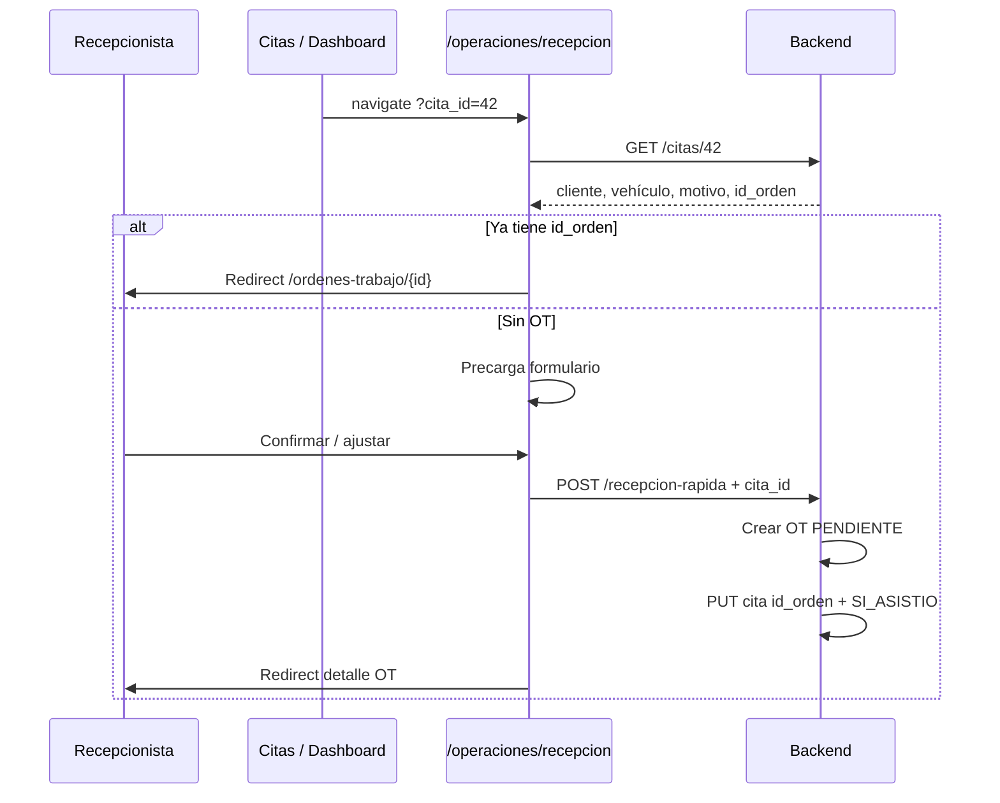

# Plan Cita → OT V2 — Análisis y diseño

**Versión:** 1.0  
**Fecha:** Junio 2026  
**Estado:** Análisis y diseño — **sin implementación**  
**Prioridad roadmap:** P2  
**Relacionado:** [PLAN_RECEPCION_RAPIDA_V2.md](./PLAN_RECEPCION_RAPIDA_V2.md) · [METODOLOGIA_DESARROLLO_V2.md](./METODOLOGIA_DESARROLLO_V2.md) · [ARQUITECTURA_OPERATIVA_V2.md](./ARQUITECTURA_OPERATIVA_V2.md)

---

## Resumen ejecutivo

Hoy **Citas** y **Órdenes de trabajo** capturan los mismos datos de forma independiente: cliente, vehículo y motivo. Cuando el cliente llega al taller, recepción vuelve a tipear todo en OT (wizard o recepción rápida).

**Objetivo P2:** usar **Recepción Rápida** como único punto de captura al convertir una cita en OT, precargando datos desde la cita y vinculando `cita.id_orden` ↔ `orden.id`.

**Hallazgo crítico:** el campo `citas.id_orden` **existe en BD** pero **ningún endpoint lo escribe** hoy. La conversión no está implementada en backend ni frontend.

**Recomendación:** flujo UI `Cita → /operaciones/recepcion?cita_id=X` (precarga) + al crear OT actualizar cita (`id_orden`, `estado=SI_ASISTIO`). Alternativa atómica: `POST /api/citas/{id}/convertir-orden`.

**Complejidad estimada:** Media-baja (3–5 días: 1.5 backend, 2 frontend, 0.5 QA).

---

## Fase 1 — Modelo y datos actuales

### 1.1 Modelo `Cita` (`app/models/cita.py`)

| Campo | Tipo | Obligatorio | Uso en conversión |
|-------|------|-------------|-------------------|
| `id_cita` | PK | Sí | Trazabilidad, query param P2 |
| `id_cliente` | FK clientes | Sí | → `RecepcionRapidaCreate.cliente_id` |
| `id_vehiculo` | FK vehiculos | No | → `vehiculo_id` (validar pertenencia) |
| `fecha_hora` | DateTime | Sí | Contexto UI; no va a OT directamente |
| `tipo` | Enum TipoCita | Sí | Opcional en notas OT / prioridad inferida |
| `estado` | Enum EstadoCita | Sí | Tras conversión → `SI_ASISTIO` |
| `motivo` | String(300) | No | → campo `motivo` recepción (≥10 chars) |
| `notas` | Text | No | Concatenar a motivo si corto |
| `motivo_cancelacion` | Text | No | No aplica en conversión |
| **`id_orden`** | FK ordenes_trabajo | No | **Vínculo cita ↔ OT (nunca se escribe hoy)** |
| `creado_en` | DateTime | Auto | Auditoría |

**Estados cita:** `CONFIRMADA`, `SI_ASISTIO`, `NO_ASISTIO`, `CANCELADA`  
**Tipos:** `REVISION`, `MANTENIMIENTO`, `REPARACION`, `DIAGNOSTICO`, `OTRO`

### 1.2 Relación con OT

```text
Cita.id_orden  →  ordenes_trabajo.id  (nullable, FK)
OrdenTrabajo   ←  backref "citas"     (1:N teórico; operación espera 1:1)
```

- Eliminar cita con `id_orden` → **400** (`citas.py` DELETE).
- Detalle cita expone `orden_vinculada` si existe (`GET /citas/{id}`).
- **No hay** `PUT` que asigne `id_orden` ni endpoint de conversión.

### 1.3 Schema API (`app/schemas/cita.py`)

- `CitaOut.id_orden` expuesto en respuestas enriquecidas.
- `CitaUpdate` **no incluye** `id_orden` (conversión requiere endpoint dedicado o ampliar schema con reglas estrictas).

---

## Fase 2 — Endpoints Citas actuales

| Método | Ruta | Roles | Relevante P2 |
|--------|------|-------|--------------|
| GET | `/api/citas/` | ADMIN, EMPLEADO, TECNICO, CAJA | Listado; filtro estado CONFIRMADA |
| GET | `/api/citas/{id}` | Idem | **Precarga recepción** (cliente, vehículo, motivo, id_orden) |
| GET | `/api/citas/dashboard/proximas` | Idem | Panel dashboard / futuro CitasHoy |
| GET | `/api/citas/alertas` | Idem | Citas vencidas sin seguimiento |
| POST | `/api/citas/` | Idem | Crear cita (sin OT) |
| PUT | `/api/citas/{id}` | Idem | Cambiar estado (SI_ASISTIO manual hoy, sin OT) |
| DELETE | `/api/citas/{id}` | Idem | Bloqueado si `id_orden` |

**Gap P2:** falta `POST /api/citas/{id}/convertir-orden` o lógica post-`recepcion-rapida` que actualice la cita.

---

## Fase 3 — Recepción rápida (base P1)

### 3.1 Contrato ya preparado

**Frontend** (`RecepcionRapidaForm`):

```javascript
initialValues={{
  cliente_id, cliente, vehiculo_id,
  motivo,   // desde cita.motivo + notas
  cita_id,
}}
```

**URL:** `/operaciones/recepcion?cita_id={id}` (hook en `RecepcionRapida.jsx`; precarga de cita **pendiente**).

**Backend** (`POST /api/ordenes-trabajo/recepcion-rapida`):

- Acepta `cita_id` opcional en body.
- **No persiste** FK en OT (no hay `cita_id` en modelo OT).
- Registra `cita_id_pendiente` en auditoría solamente.

### 3.2 Flujo objetivo P2



---

## Fase 4 — Datos reutilizables y mapeo

| Origen (Cita) | Destino (Recepción / OT) | Regla |
|---------------|--------------------------|-------|
| `id_cliente` | `cliente_id` | Obligatorio |
| `id_vehiculo` | `vehiculo_id` | Obligatorio para recepción; si null → forzar alta/selección |
| `motivo` | `motivo` (UI) | Si &lt; 10 chars, enriquecer con `notas` o texto tipo cita |
| `notas` | parte de `motivo` | `trim(motivo + " — " + notas)` si hace falta longitud |
| `tipo` | (opcional) | Mostrar en UI; no mapear a BD OT en P2 |
| `fecha_hora` | (informativo) | Banner "Cita programada: …" |
| `id_cita` | `cita_id` en POST | Trazabilidad + update cita post-crear |

| Post-crear OT | Actualizar Cita |
|---------------|-----------------|
| `orden.id` | `cita.id_orden = orden.id` |
| — | `cita.estado = SI_ASISTIO` |

**Motivo duplicado eliminado:** una sola captura en recepción; cita solo se lee.

---

## Fase 5 — Duplicación actual (problema)

### 5.1 Frontend Citas (`Citas.jsx`)

| Elemento | Estado | Problema |
|----------|--------|----------|
| Autocomplete cliente | Manual (500 clientes) | Duplica lógica vs `ClienteAutocompleteConAltaRapida` |
| Modal vehículo | Inline duplicado | No usa `ModalVehiculoRapido` |
| Motivo / notas | Campos propios | Re-captura en OT |
| Conversión OT | Solo muestra `orden_vinculada` | Sin botón "Recibir en taller" |
| Marcar asistencia | PUT estado | No crea OT |

### 5.2 Flujo operativo hoy

1. Crear cita (cliente, vehículo, motivo).
2. Cliente llega → marcar `SI_ASISTIO` (opcional).
3. Ir a OT nueva o recepción → **re-ingresar** cliente, vehículo, motivo.

**Meta P2:** paso 3 → un clic desde cita a recepción precargada.

---

## Fase 6 — Opciones de implementación (decisión pendiente)

### Opción A — Orquestación frontend (recomendada fase 1)

1. `GET /citas/{id}` → precargar `RecepcionRapidaForm`.
2. `POST /recepcion-rapida` con `cita_id`.
3. Nuevo **`PATCH /api/citas/{id}/vincular-orden`** `{ id_orden }` con validaciones:
   - Rol recepción (ADMIN, CAJA, EMPLEADO).
   - Cita en `CONFIRMADA` o vencida CONFIRMADA.
   - `id_orden` vacío.
   - OT mismo cliente (y vehículo si ambos tienen FK).

**Pros:** reutiliza endpoint P1; cambios acotados.  
**Contras:** dos requests; riesgo de OT huérfana si falla paso 3.

### Opción B — Endpoint atómico (recomendada producción)

`POST /api/citas/{id}/convertir-orden`

Body opcional: `{ motivo?, prioridad?, tecnico_id?, kilometraje? }` — override de precarga.

Transacción:

1. Validar cita elegible.
2. Crear OT vía lógica compartida con `crear_recepcion_rapida`.
3. `cita.id_orden = ot.id`, `cita.estado = SI_ASISTIO`.
4. Auditoría `CITA_CONVERTIDA_OT`.

**Pros:** consistencia, idempotencia posible.  
**Contras:** más backend; UI puede seguir usando formulario de confirmación antes del POST.

### Opción C — Solo query param sin vínculo BD

No recomendado: deja `id_orden` null y pierde trazabilidad.

---

## Fase 7 — Reglas de negocio propuestas

| Regla | Descripción |
|-------|-------------|
| Elegibilidad | Cita `CONFIRMADA` (incl. vencida) y `id_orden IS NULL` |
| Ya convertida | Si `id_orden` → redirect detalle OT, no duplicar |
| Cancelada / NO_ASISTIO | No convertir; mensaje claro |
| Vehículo obligatorio | Si cita sin vehículo → recepción exige selección/alta antes de POST |
| Motivo mínimo 10 | Combinar motivo+notas+tipo en precarga |
| Roles conversión | Mismos que recepción: ADMIN, CAJA, EMPLEADO |
| TECNICO | Puede ver cita; conversión vía recepción prohibida (403) |

---

## Fase 8 — Puntos de entrada UI (P2)

| Origen | Acción |
|--------|--------|
| `Citas.jsx` — fila / detalle | Botón "Recibir en taller" → `/operaciones/recepcion?cita_id=` |
| `Dashboard.jsx` — citas próximas | Mismo enlace por cita |
| Walk-in sin cita | `/operaciones/recepcion` sin param (sin cambio) |

**No eliminar** módulo Citas; solo dejar de duplicar captura hacia OT.

---

## Fase 9 — Pruebas planificadas (P2)

| # | Escenario |
|---|-----------|
| 1 | Cita CONFIRMADA con cliente+vehículo+motivo → OT + vínculo |
| 2 | Cita sin vehículo → precarga cliente → alta vehículo → OT |
| 3 | Cita ya con id_orden → redirect detalle, no duplicar |
| 4 | Cita CANCELADA → botón deshabilitado / 400 |
| 5 | Motivo corto en cita → precarga enriquecida ≥10 |
| 6 | Rol TECNICO → sin conversión |
| 7 | Idempotencia: doble clic no crea dos OT |

---

## Fase 10 — Estimación y dependencias

| Tarea | Días |
|-------|------|
| Backend vínculo cita↔OT (A o B) | 1–1.5 |
| Precarga `?cita_id=` en RecepcionRapida | 0.5–1 |
| Botones Citas + Dashboard | 0.5–1 |
| Tests E2E | 0.5–1 |
| QA + docs | 0.5 |

**Dependencias:** P1 Recepción Rápida **cerrado** ✅

**Deuda relacionada (no P2):** adopción `ClienteAutocompleteConAltaRapida` / `VehiculoSelectorConAltaRapida` dentro de `Citas.jsx`.

---

## Control de versiones

| Versión | Fecha | Cambios |
|---------|-------|---------|
| 1.0 | Jun 2026 | Análisis inicial P2 — sin implementación |

**Próximo paso:** Aprobar Opción A vs B → IMP-P2-1 Backend → IMP-P2-2 Frontend precarga + botones.
