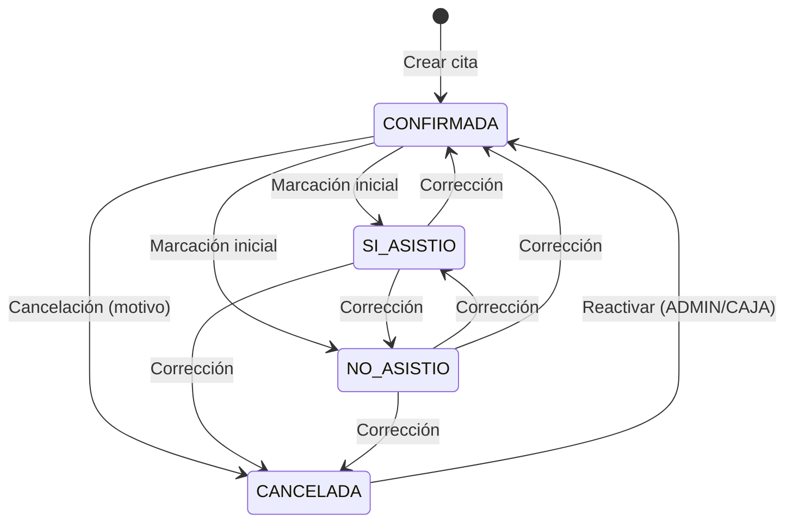

# Plan Corrección de Estado de Citas V2

**Versión:** 1.0  
**Fecha de creación:** 8 de junio de 2026  
**Estado:** Fase 1 (backend) y Fase 2 (frontend) **implementadas** en `main`  
**Relacionado:** [LOGICA_CITAS.md](./LOGICA_CITAS.md) · [PLAN_CITA_A_OT_V2.md](./PLAN_CITA_A_OT_V2.md) · [QA_CITAS_FASE2_PRODUCCION.md](./QA_CITAS_FASE2_PRODUCCION.md)

---

## Control de versiones del documento

| Versión | Fecha | Cambios |
|---------|-------|---------|
| 1.0 | 2026-06-08 | Documento inicial: arquitectura aprobada e implementada (Fases 1–2), roadmap 3–4 |

---

## Commits de referencia

| Fase | Commit | Descripción |
|------|--------|-------------|
| Fase 1 — Backend | `d903ebe` | Transiciones gobernadas, historial, PATCH, rechazo PUT con `estado` |
| Fase 2 — Frontend | `56d3ea1` | UI migrada a PATCH, modal de corrección, `estado_meta` |
| QA producción | `a6e463b` | Checklist post-deploy |
| Migración Alembic | `b8c9d0e1f2a3` | Tabla `cita_estado_historial` + columna `estado_origen_cierre` |

---

## 1. Contexto y problema original

### Situación previa

El módulo de Citas permitía cambiar `estado` mediante `PUT /api/citas/{id}` sin reglas centralizadas, sin historial append-only y sin distinción entre:

- **Marcación inicial** (primera decisión operativa desde `CONFIRMADA`: asistió, no asistió, canceló).
- **Corrección** (ajuste posterior a un cierre ya registrado).

Esto generaba:

1. **Riesgo operativo:** cualquier rol con acceso a editar cita podía “reescribir” el pasado sin trazabilidad.
2. **Riesgo analítico:** reportes de no-show mezclaban estado actual con correcciones sin auditoría.
3. **Incompatibilidad con Cita → OT:** conversiones y marcaciones manuales no dejaban un rastro unificado de eventos.
4. **Deuda frontend:** botones sueltos (`Cambiar a Sí asistió`, `Reactivar`) duplicaban reglas que debían vivir en backend.

### Decisión arquitectónica

Separar **edición de datos** (fecha, motivo, notas) de **transición de estado** (endpoint dedicado, servicio único, historial inmutable, meta calculada por rol).

---

## 2. Objetivos

| Objetivo | Estado |
|----------|--------|
| Centralizar reglas de transición en backend (`cita_estado_service.py`) | ✅ Fase 1 |
| Rechazar cambio de `estado` vía PUT | ✅ Fase 1 |
| Exponer `PATCH /api/citas/{id}/estado` con validación de rol, ventana y motivos | ✅ Fase 1 |
| Registrar cada evento en `cita_estado_historial` | ✅ Fase 1 |
| Capturar primer cierre en `estado_origen_cierre` (inmutable) | ✅ Fase 1 |
| Exponer `estado_meta` en detalle para que el frontend no duplique matriz | ✅ Fase 1 + 2 |
| UI: marcación inicial, cancelación con motivo, modal de corrección | ✅ Fase 2 |
| Integrar historial al vincular OT | ✅ Fase 1 |
| Reportes operativo vs calidad (KPI dual) | ⏳ Fase 3 |
| Bloqueo financiero y desvinculación OT | ⏳ Fase 4 |

---

## 3. Reglas de negocio aprobadas

### 3.1 Estados válidos

| Estado | Significado |
|--------|-------------|
| `CONFIRMADA` | Cita agendada; pendiente de marcación operativa |
| `SI_ASISTIO` | Cliente asistió al taller |
| `NO_ASISTIO` | Cliente no se presentó |
| `CANCELADA` | Cliente avisó que no podrá; requiere `motivo_cancelacion` |

Ver ciclo de vida base en [LOGICA_CITAS.md](./LOGICA_CITAS.md).

### 3.2 Marcación inicial vs corrección

| Tipo | Condición | Motivo |
|------|-----------|--------|
| **Marcación inicial** | `CONFIRMADA` → cualquier otro estado | No requiere `motivo_codigo`. Cancelación requiere `motivo_cancelacion`. |
| **Corrección** | Cualquier transición desde estado ya cerrado | Requiere `motivo_codigo` (+ `motivo_detalle` si `OTRO` ≥ 10 caracteres). Cancelación en corrección también exige `motivo_cancelacion`. |

### 3.3 Motivos de corrección (`motivo_codigo`)

| Código | Uso |
|--------|-----|
| `ERROR_CAPTURA` | Error de captura en recepción/agenda |
| `CLIENTE_TARDE` | Cliente llegó tarde; se re-clasifica asistencia |
| `CLIENTE_CONFIRMO_DESPUES` | Confirmación tardía del cliente |
| `ERROR_RECEPCION` | Error operativo en recepción |
| `OTRO` | Requiere `motivo_detalle` mínimo 10 caracteres |

### 3.4 Edición de cita (sin cambio de estado)

`PUT /api/citas/{id}` sigue permitido para: `id_vehiculo`, `fecha_hora`, `tipo`, `motivo`, `notas`.  
Si el body incluye `estado` → **400** con mensaje que redirige al PATCH.

### 3.5 Autoridad

El **backend** es la fuente de verdad. El frontend consume `estado_meta.transiciones_permitidas` y no replica la matriz de transiciones.

---

## 4. Ventana de 24 horas

### Definición

Ventana activa cuando:

```
fecha_hora de la cita ≤ ahora_local() ≤ fecha_hora + 24 horas
```

Implementación: `ventana_correccion_activa()` en `app/services/cita_estado_service.py`.

### Efecto en permisos

| Rol | Dentro de ventana 24h | Fuera de ventana 24h |
|-----|----------------------|----------------------|
| ADMIN | Correcciones permitidas (salvo reglas OT) | Correcciones permitidas |
| CAJA / EMPLEADO | Correcciones operativas permitidas | **No** pueden corregir |
| TECNICO | Solo marcación inicial desde CONFIRMADA | Solo marcación inicial (si aplica) |

La ventana **no aplica** a marcación inicial (`CONFIRMADA` → cierre).

---

## 5. Roles y permisos

### 5.1 Marcación inicial (`CONFIRMADA` → cierre)

Roles: **ADMIN**, **CAJA**, **EMPLEADO**, **TECNICO**.

### 5.2 Corrección de estados cerrados

| Rol | Permiso |
|-----|---------|
| **ADMIN** | Siempre (incluye post-24h y cita con OT) |
| **CAJA** / **EMPLEADO** | Solo dentro ventana 24h y **sin OT** vinculada |
| **TECNICO** | **No** puede corregir estados cerrados |

### 5.3 Reactivar cancelada

`CANCELADA` → `CONFIRMADA`: solo **ADMIN** o **CAJA**.

### 5.4 Cita con OT vinculada (`id_orden` NOT NULL)

- Corrección de estado: **solo ADMIN**.
- Auditoría reforzada: evento `CITA_ESTADO_CORREGIDO` con flag `correccion_con_ot: true`.
- Conversión a OT no sustituye el PATCH; ver sección 10.

### 5.5 Códigos HTTP de rechazo

| Código | Escenario |
|--------|-----------|
| 400 | Transición inválida, motivo faltante, mismo estado |
| 403 | Rol insuficiente, ventana expirada, técnico en corrección, no-ADMIN con OT |
| 409 | Reservado Fase 4 (`CITA_ESTADO_BLOQUEADO_FINANCIERO`); conversión OT inválida (`ESTADO_NO_CONVERTIBLE`) |

---

## 6. Matriz de transiciones

Matriz autoritativa en backend (`TRANSICIONES_PERMITIDAS`):

| Desde ↓ / Hacia → | CONFIRMADA | SI_ASISTIO | NO_ASISTIO | CANCELADA |
|-------------------|:----------:|:----------:|:----------:|:---------:|
| **CONFIRMADA** | — | ✅ | ✅ | ✅ |
| **SI_ASISTIO** | ✅ | — | ✅ | ✅ |
| **NO_ASISTIO** | ✅ | ✅ | — | ✅ |
| **CANCELADA** | ✅ | ❌ | ❌ | — |

✅ = permitido en matriz (sujeto a rol, ventana y OT).  
La UI solo ofrece destinos presentes en `estado_meta.transiciones_permitidas` para el usuario actual.



---

## 7. `estado_origen_cierre`

### Propósito

Preservar el **primer cierre** registrado al salir de `CONFIRMADA`, independientemente de correcciones posteriores. Soporta KPI de calidad vs snapshot operativo.

### Reglas

1. Columna nullable en `citas` (ENUM `EstadoCita`).
2. Se asigna **una sola vez** en la primera transición `CONFIRMADA` → estado cerrado (`SI_ASISTIO`, `NO_ASISTIO` o `CANCELADA`).
3. También puede fijarse al vincular OT si la cita pasa a `SI_ASISTIO` desde `CONFIRMADA` vía conversión.
4. **Inmutable** tras la primera asignación: correcciones no la modifican.

### Ejemplo

| Paso | `estado` | `estado_origen_cierre` |
|------|----------|------------------------|
| Crear | CONFIRMADA | NULL |
| Marcar asistió | SI_ASISTIO | SI_ASISTIO |
| Corregir → CONFIRMADA | CONFIRMADA | SI_ASISTIO *(sin cambio)* |
| Corregir → NO_ASISTIO | NO_ASISTIO | SI_ASISTIO *(sin cambio)* |

---

## 8. `cita_estado_historial`

### Propósito

Log **append-only** de transiciones para auditoría, KPI de calidad y reconstrucción de eventos.

### Esquema (migración `b8c9d0e1f2a3`)

| Columna | Tipo | Descripción |
|---------|------|-------------|
| `id` | PK | Identificador del evento |
| `id_cita` | FK | Cita afectada |
| `estado_anterior` | String(20), nullable | NULL en creación |
| `estado_nuevo` | String(20) | Estado resultante |
| `motivo_codigo` | String(40), nullable | Solo correcciones |
| `motivo_detalle` | Text, nullable | Detalle / OTRO |
| `id_usuario` | FK | Quién ejecutó la acción |
| `id_orden` | FK, nullable | OT vinculada al momento del evento |
| `origen` | String(30) | Origen del evento |
| `creado_en` | DateTime | Timestamp UTC |

### Valores de `origen`

| Origen | Cuándo |
|--------|--------|
| `CREACION` | Alta de cita (`CONFIRMADA`) |
| `MANUAL` | PATCH `/estado` por usuario |
| `CONVERTIR_OT` | Conversión cita → OT |
| `RECEPCION_RAPIDA` | Vinculación vía recepción rápida (si aplica) |

### Auditoría paralela

Correcciones (no marcación inicial) generan además registro en módulo Auditoría: acción `CITA_ESTADO_CORREGIDO`, entidad `CITA`.

---

## 9. `PATCH /api/citas/{id}/estado`

### Request

```json
{
  "estado_nuevo": "SI_ASISTIO",
  "motivo_codigo": "ERROR_CAPTURA",
  "motivo_detalle": "Opcional salvo OTRO",
  "motivo_cancelacion": "Requerido si estado_nuevo es CANCELADA"
}
```

### Response (`CitaEstadoPatchResponse`)

```json
{
  "id_cita": 123,
  "estado": "SI_ASISTIO",
  "estado_origen_cierre": "SI_ASISTIO",
  "motivo_cancelacion": null,
  "id_orden": null,
  "ultimo_evento": { "...": "CitaEstadoHistorialOut" },
  "estado_meta": { "...": "CitaEstadoMetaOut" }
}
```

### Roles del endpoint

`ADMIN`, `EMPLEADO`, `TECNICO`, `CAJA` (permisos efectivos según reglas de sección 5).

### Implementación

- Router: `app/routers/citas.py` → `cambiar_estado_cita`
- Servicio: `app/services/cita_estado_service.py` → `aplicar_transicion_estado`
- Tests: `tests/test_cita_estado_correccion.py`

---

## 10. `estado_meta`

Objeto calculado por rol y contexto de la cita. Expuesto en:

- `GET /api/citas/{id}` (detalle enriquecido)
- Respuesta del PATCH
- Flags ligeros en listado (`estado_editable`, `tiene_ot`, `bloqueo_financiero`)

### Campos

| Campo | Descripción |
|-------|-------------|
| `transiciones_permitidas` | Lista de estados destino válidos para el usuario actual |
| `requiere_motivo` | True si alguna transición disponible es corrección (no marcación inicial) |
| `estado_editable` | True si hay al menos una transición permitida |
| `ventana_activa` | True si está dentro de las 24h post `fecha_hora` |
| `tiene_ot` | True si `id_orden` NOT NULL |
| `bloqueo_financiero` | Siempre `false` en Fase 1–2; Fase 4 lo activará con OT con venta/pagos |

### Uso en frontend (Fase 2)

- `Citas.jsx`: botones derivados de `estado_meta` + reglas de presentación (no de negocio).
- `ModalCorregirEstadoCita.jsx`: select de destino desde `transiciones_permitidas`.
- `frontend/src/utils/citaEstados.js`: solo labels, colores y mensajes de error.

**Importante:** el listado `GET /api/citas/` no incluye `transiciones_permitidas` completas; el detalle debe obtenerse con `GET /api/citas/{id}` antes de corregir.

---

## 11. Integración con Cita → OT

Documento detallado: [PLAN_CITA_A_OT_V2.md](./PLAN_CITA_A_OT_V2.md).

### Reglas de conversión (P2 + estados V2)

| Estado cita | ¿Convertir a OT? |
|-------------|------------------|
| `CONFIRMADA` | ✅ Sí |
| `SI_ASISTIO` | ✅ Sí |
| `NO_ASISTIO` | ❌ No (`409 ESTADO_NO_CONVERTIBLE`) |
| `CANCELADA` | ❌ No |

### Efecto al convertir

1. Se crea OT `PENDIENTE` y se asigna `cita.id_orden`.
2. Si la cita no estaba en `SI_ASISTIO`, pasa a `SI_ASISTIO`.
3. Se registra evento en `cita_estado_historial` con origen `CONVERTIR_OT`.
4. Se puede fijar `estado_origen_cierre` si era la primera salida de `CONFIRMADA`.

### Corrección con OT vinculada

- UI muestra **Ver OT**; **Convertir a OT** no aplica.
- **Corregir estado** solo si backend devuelve transiciones (típicamente ADMIN).
- Desvincular OT sin borrar historial: **no implementado** (deuda Fase 4).

---

## 12. KPIs operativos vs KPIs de auditoría

### KPI operativo (snapshot)

- **Fuente:** `citas.estado` actual.
- **Uso:** operación del día, listados, alertas de citas vencidas, reporte `GET /api/citas/reportes/asistencia`.
- **Comportamiento:** una corrección `NO_ASISTIO` → `SI_ASISTIO` **actualiza** el KPI operativo (el cliente “sí asistió” hoy).

### KPI de auditoría / calidad

- **Fuente:** `cita_estado_historial` (+ auditoría `CITA_ESTADO_CORREGIDO`).
- **Uso:** medir errores de captura, frecuencia de correcciones, cumplimiento por usuario, análisis de no-show “original” vía `estado_origen_cierre`.
- **Comportamiento:** eventos históricos **no se reescriben**; una corrección agrega filas, no borra el no-show original.

### Principio dual aprobado

| Pregunta | Fuente |
|----------|--------|
| ¿Cómo está la cita **ahora**? | `citas.estado` |
| ¿Qué pasó **realmente** en operación y hubo correcciones? | `cita_estado_historial` + `estado_origen_cierre` |

Fase 3 formalizará reportes separados operativo vs calidad.

---

## 13. Fases 1–4 (roadmap)

### Fase 1 — Backend ✅ Implementada (`d903ebe`)

- Servicio `cita_estado_service.py`
- Modelo `CitaEstadoHistorial`, campo `estado_origen_cierre`
- `PATCH /api/citas/{id}/estado`
- PUT rechaza `estado`
- `estado_meta` en GET detalle; flags en listado
- Historial en creación, PATCH manual y vinculación OT
- Migración `b8c9d0e1f2a3`
- Tests `test_cita_estado_correccion.py`

### Fase 2 — Frontend ✅ Implementada (`56d3ea1`)

- `Citas.jsx`: PATCH para marcación y cancelación
- `ModalCorregirEstadoCita.jsx`: correcciones con motivo
- `citaEstados.js`: presentación y errores
- Detalle siempre desde GET enriquecido
- Sin matriz duplicada en frontend

### Fase 3 — Reportes ⏳ Pendiente

- Reporte **operativo**: snapshot por `citas.estado` (existente parcialmente en `/reportes/asistencia`).
- Reporte **calidad**: métricas desde historial (correcciones, `estado_origen_cierre`, usuarios, motivos).
- Dashboard o exportación para gerencia operativa.

### Fase 4 — Bloqueo financiero y OT ⏳ Pendiente

- `bloqueo_financiero: true` cuando OT tenga venta o pagos → PATCH bloqueado (`409 CITA_ESTADO_BLOQUEADO_FINANCIERO`).
- Acción ADMIN **desvincular OT** (separada del PATCH; no implementada).
- UI ya preparada para mostrar bloqueo (`estado_meta.bloqueo_financiero`, mensajes en `citaEstados.js`).

---

## 14. Riesgos

| Riesgo | Impacto | Mitigación |
|--------|---------|------------|
| Deploy backend sin Fase 2 frontend | Botones de estado rotos (400 en PUT) | Deploy conjunto; ver [QA_CITAS_FASE2_PRODUCCION.md](./QA_CITAS_FASE2_PRODUCCION.md) |
| Deploy sin migración Alembic | 500 en PATCH / columnas faltantes | `preDeployCommand` en `railway.toml`; verificar head `b8c9d0e1f2a3` |
| Corrección post-24h por no-ADMIN | Frustración operativa | Mensaje claro 403; escalar a ADMIN |
| Confusión KPI no-show | Reportes incorrectos | Usar fuente dual (sección 12); Fase 3 |
| Corrección con OT sin desvincular | Inconsistencia OT ↔ cita | Solo ADMIN + auditoría; Fase 4 desvinculación |
| Downgrade de migración en prod con historial | Pérdida de auditoría | Preferir hotfix forward; backup previo |

---

## 15. Estrategia de rollback

Detalle operativo en [QA_CITAS_FASE2_PRODUCCION.md](./QA_CITAS_FASE2_PRODUCCION.md) (Fase C).

### Escenarios

| Escenario | Acción |
|-----------|--------|
| UI rota, API OK | Revert frontend (`56d3ea1`); backend puede permanecer |
| API PATCH rota (schema) | Hotfix forward o rollback completo |
| Rollback completo | `alembic downgrade a7b8c9d0e1f2` + redeploy pre-`d903ebe` |

### Rollback de schema (destructivo)

```sql
DROP TABLE IF EXISTS cita_estado_historial;
ALTER TABLE citas DROP COLUMN estado_origen_cierre;
-- Actualizar alembic_version a a7b8c9d0e1f2
```

**Advertencia:** solo en ventana de mantenimiento con backup. Si ya hubo correcciones en producción, preferir corregir hacia adelante.

### Backup mínimo pre-deploy

```bash
mysqldump -h <HOST> -u <USER> -p <DB> citas alembic_version > backup_pre_citas_estados_v2.sql
```

---

## 16. Referencias cruzadas

| Documento | Relación con este plan |
|-----------|------------------------|
| [LOGICA_CITAS.md](./LOGICA_CITAS.md) | Ciclo de vida, campos y flujos UI base. **Actualizar** sección PUT/acciones tras deploy Fase 2 (PUT ya no cambia estado). |
| [PLAN_CITA_A_OT_V2.md](./PLAN_CITA_A_OT_V2.md) | Conversión OT, estados convertibles, vínculo `id_orden`, historial al convertir. |
| [QA_CITAS_FASE2_PRODUCCION.md](./QA_CITAS_FASE2_PRODUCCION.md) | Checklist pre-deploy, 20 pruebas producción, cierre de liberación y rollback. |

### Archivos de código (referencia)

| Área | Ruta |
|------|------|
| Servicio de estados | `app/services/cita_estado_service.py` |
| Router citas | `app/routers/citas.py` |
| Modelo historial | `app/models/cita_estado_historial.py` |
| Modelo cita | `app/models/cita.py` |
| Integración OT | `app/services/recepcion_ot_service.py` |
| UI citas | `frontend/src/pages/Citas.jsx` |
| Modal corrección | `frontend/src/components/operaciones/ModalCorregirEstadoCita.jsx` |
| Util presentación | `frontend/src/utils/citaEstados.js` |
| Migración | `alembic/versions/b8c9d0e1f2a3_cita_estado_historial_y_origen_cierre.py` |

---

**Próxima revisión:** tras deploy producción Fase 1+2 o al iniciar Fase 3 (reportes).
