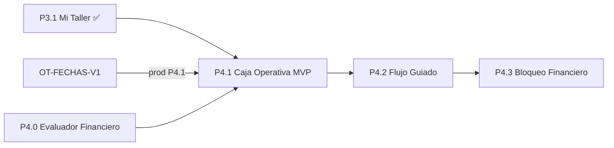

# PLAN P4 — Caja Operativa Medina AutoDiag V2

**Versión:** 1.1  
**Fecha:** Junio 2026  
**Estado:** ✅ **APROBADO ARQUITECTÓNICAMENTE** — pendiente implementación por sub-hito  
**Relacionado:** [ARQUITECTURA_OPERATIVA_V2.md](./ARQUITECTURA_OPERATIVA_V2.md) · [CIERRE_P3_1_MI_TALLER.md](./CIERRE_P3_1_MI_TALLER.md) · [PLAN_A0_CAPA_OPERATIVA_CENTRAL.md](./PLAN_A0_CAPA_OPERATIVA_CENTRAL.md) · [METODOLOGIA_DESARROLLO_V2.md](./METODOLOGIA_DESARROLLO_V2.md) · [ADR_P4_0_EVALUADOR_FINANCIERO.md](./ADR_P4_0_EVALUADOR_FINANCIERO.md)

---

## Veredicto arquitectónico

| Criterio | Decisión |
|----------|----------|
| **Dirección P4** | ✅ **GO** — siguiente hito principal tras P3.1 |
| **Documentación** | ✅ **GO** — este plan queda formalmente aprobado |
| **Implementación P4.1 en producción** | ⚠️ **GO condicionado** — ver dependencias obligatorias abajo |

### Condiciones obligatorias antes de producción P4.1

1. **OT-FECHAS-V1** identificado como **dependencia crítica de producción** — debe desplegarse antes de promover P4.1 a prod (desarrollo P4 puede avanzar en paralelo en staging).
2. **P4.0 Evaluador Financiero** es **prerrequisito técnico** de P4.1 — no es opcional ni “ajuste menor”. Diseño normativo: [ADR_P4_0_EVALUADOR_FINANCIERO.md](./ADR_P4_0_EVALUADOR_FINANCIERO.md).
3. **Contrato A0 v2** (`meta.version_contrato = "a0-v2"`) es obligatorio en P4.0.
4. **Invariante de coherencia:** P4.1 **no puede salir a producción** si existe **cualquier** escenario donde A0 muestre `acciones[].permitida = true` y el backend rechace la mutación correspondiente (turno cerrado, saldo inválido, venta inexistente, etc.).
5. ~~**P4.1 UI no puede iniciar** hasta P4.0 implementado y validado~~ — **P4.0 cerrado** (`86afda7`, `2c9b8df`); P4.1 Fase 0+1 autorizadas — ver [CHECKLIST_P4_1_CAJA_OPERATIVA.md](./CHECKLIST_P4_1_CAJA_OPERATIVA.md).

---

## 1. Contexto

### 1.1 Estado actual del sistema

| Capa / hito | Estado | Notas |
|-------------|--------|-------|
| **A0 — Capa Operativa Central** | ✅ Cerrado en producción | `GET /api/operaciones/resumen`; bandejas financieras calculadas |
| **PREREQ — Evaluador acciones OT** | ✅ Cerrado en producción | `ot_acciones_service.py`; acciones técnicas gobernadas |
| **P3.1 — Mi Taller** | ✅ Cerrado y validado en prod | Commit `658a3a2`; cierre [CIERRE_P3_1_MI_TALLER.md](./CIERRE_P3_1_MI_TALLER.md) |
| **Flujo técnico** | ✅ Validado | PENDIENTE → EN_PROCESO → COMPLETADA (OT-20260610-0001) |
| **P4 — Caja Operativa** | 🔲 Planificado | Gap operativo: cobro + entrega fragmentados en módulos legacy |

### 1.2 Análisis previo

| Documento / actividad | Resultado |
|----------------------|-----------|
| PRE-CHECK P4 Caja Operativa | GO condicionado P4.1 MVP |
| Revisión arquitectónica 2º nivel | P4 **no es solo frontend**; requiere P4.0 + reglas de dominio |
| Cierre documental P3.1 | Commit `443bb42` en `main` |

### 1.3 Gap operativo (por qué P4)

Hoy el cierre financiero del Flujo A está **fragmentado**:

```
OT COMPLETADA (Mi Taller)
    → Órdenes de Trabajo (crear venta 💰)
    → Ventas (registrar pago — requiere turno en /caja)
    → Órdenes de Trabajo (entregar)
    → Caja (apertura/cierre turno, cortes)
```

A0 **diagnostica** el estado (`ot_pendientes_cobro`, `ot_listas_entrega`, `ventas_saldo_pendiente`, `caja.turno_abierto`), pero **no existe superficie operativa unificada** en `/operaciones/caja`.

### 1.4 Brecha detectada en A0 (motivo de P4.0)

El evaluador central gobierna acciones técnicas (`iniciar_ot`, `finalizar_ot`, `crear_venta_desde_ot`, `entregar_vehiculo`), pero **`registrar_pago` no forma parte del contrato oficial del Evaluador Central**.

Consecuencia actual:

- A0 puede mostrar `registrar_pago` con `permitida = true` (solo por rol).
- `POST /api/pagos/` rechaza la operación si no hay turno abierto.

Esto **rompe** el principio probado en P3.1:

```
Backend == A0 == acciones[] == UI
```

P4.0 existe para **cerrar esta brecha**, no para agregar una funcionalidad nueva.

---

## 2. Objetivo P4

### 2.1 Qué es Caja Operativa

**Caja Operativa** es una **superficie operativa de mostrador** dentro del Centro Operativo.

**Responsabilidades:**

| Sí | Descripción |
|----|-------------|
| Cobrar | Crear venta desde OT completada cuando corresponda |
| Confirmar pagos | Registrar pagos contra ventas con saldo pendiente |
| Entregar vehículos | Ejecutar entrega cuando la OT está lista |

**Ruta:** `/operaciones/caja`  
**Roles:** ADMIN, CAJA (misma experiencia — ver §3.4 Modo Mostrador)

### 2.2 Qué NO es Caja Operativa

Caja Operativa **no es un módulo financiero**. No absorbe responsabilidades de:

| No | Módulo / función que sigue siendo dueño |
|----|----------------------------------------|
| Administración de ventas | `/ventas` — CRUD, edición, cancelación, reportes |
| Reportería financiera | `/dashboard`, reportes de utilidad, ingresos |
| Apertura / cierre de caja | `/caja` — turnos, cortes, histórico, alertas |
| Configuración de comisiones | Módulo comisiones / configuración |
| Gestión contable | VentasService, pagos, auditoría contable |

**Regla de contención:** P4 debe resistir scope creep hacia Ventas o Caja legacy. Si una funcionalidad es administrativa o contable, **permanece en su módulo**.

### 2.3 Qué no reemplaza

| Módulo legacy | Relación con P4 |
|---------------|-----------------|
| `/ventas` | Coexistencia; administración y ventas mostrador sin OT |
| `/caja` | Coexistencia; apertura de turno sigue aquí |
| `/ordenes-trabajo` | Coexistencia; edición OT, cotización, administración |

---

## 3. Principios arquitectónicos

### 3.1 Principios obligatorios

1. **Backend es autoridad** de reglas de negocio y permisos.
2. **Backend == A0 == acciones[] == UI** — ninguna superficie operativa puede mostrar acciones que el backend rechazaría.
3. **Frontend no decide permisos** por `estado`, `rol` local ni heurísticas (`if COMPLETADA → Cobrar`).
4. **Mutaciones delegadas** a APIs existentes — P4 no duplica lógica contable.
5. **No reescribir** `/ventas` ni `/caja`.
6. **P4 ≠ P5 Dashboard** — sin KPIs financieros nuevos en P4.
7. **Sin Alembic** en HOTFIX OT-FECHAS-V1, P4.0 y P4.1.

### 3.2 P4.0 como extensión de la capa A0

**P4.0 no se documenta como un parche funcional aislado.**

Conceptualmente, P4.0 **fortalece la Capa Operativa Central (A0)** y el principio **Backend = Fuente Única de Verdad**:

| Aspecto | Antes de P4.0 | Después de P4.0 |
|---------|---------------|-----------------|
| Evaluador Central | Acciones técnicas + parcialmente financieras | Contrato completo incluye **`registrar_pago`** |
| OperacionesService | Construye `registrar_pago` manualmente por rol | Delega al Evaluador Central |
| Objetivo | — | **Eliminar inconsistencias UI ↔ backend**, no agregar features |

P4.0 es el **cierre arquitectónico de A0** para el dominio financiero-operativo del mostrador. **Fuente normativa:** [ADR_P4_0_EVALUADOR_FINANCIERO.md](./ADR_P4_0_EVALUADOR_FINANCIERO.md).

**Contrato A0 v2:** `meta.version_contrato = "a0-v2"` — obligatorio; ver ADR §1.

**Acciones globales v2:** `registrar_pago` es `item_only`; en `acciones_globales` **nunca** `permitida=true` (`REQUIERE_CONTEXTO_ENTIDAD`). Ver ADR §1.4.

**Evaluador:** `acciones_operativas_service` (nuevo); `ot_acciones_service` conserva acciones OT puras. Ver ADR §2.

**Deduplicación:** regla de dominio en `OperacionesService`; frontend **prohibido** deduplicar. Ver ADR §3.

**Venta CANCELADA + OT:** tratada como venta no activa → OT en `ot_pendientes_cobro`; `crear_venta_desde_ot` permitida. Ver ADR §4.

**Fuera de P4.0:** comisiones, `VentasService` core, `pagos.py` core, Alembic. Ver ADR §5.

### 3.3 Modo Mostrador (ADMIN = CAJA)

En `/operaciones/caja`, **ADMIN y CAJA ven exactamente la misma interfaz**.

| Principio | Detalle |
|-----------|---------|
| Modo Mostrador | Misma UI para todos los operadores de caja |
| Bandejas visibles | Solo financiero-operativas: por cobrar OT, listas entrega, ventas saldo sin OT |
| Bandejas técnicas | **No** se muestran en Caja Operativa — permanecen en Mi Taller |
| Supervisión técnica ADMIN | Modo Supervisor en `/operaciones/mi-taller` (P3-UX-006), no mezclado con cobro |

A0 puede seguir devolviendo bandejas técnicas en el payload para otros consumidores; **Caja Operativa filtra en presentación** qué bandejas renderiza, pero **nunca inventa reglas** — solo consume las bandejas financieras acordadas.

### 3.4 Invariante de deduplicación (regla de dominio)

**Una misma OT no puede aparecer simultáneamente en dos bandejas que representen el mismo paso del flujo financiero.**

Esta regla es **invariante operativa de dominio**, implementada en **OperacionesService (A0)**, no como ajuste visual de frontend.

**Reglas de partición:**

| Bandeja | Contenido permitido |
|---------|---------------------|
| `ot_pendientes_cobro` | OT `COMPLETADA` **sin venta activa**, o **con venta activa y saldo > ε** |
| `ot_listas_entrega` | OT `COMPLETADA` **con venta activa y saldo ≤ ε** |
| `ventas_saldo_pendiente` | Ventas con saldo > ε **sin** `id_orden`, **o** ventas de mostrador no vinculadas a OT en cobro |

**Exclusión explícita (P4.0):**

> Si una venta tiene `id_orden` vinculado a una OT presente en `ot_pendientes_cobro`, **no debe aparecer** también en `ventas_saldo_pendiente`.

El frontend **no deduplica** — confía en que A0 ya aplicó la regla.

### 3.5 Restricción de comisiones (todas las fases P4)

**P4 no modifica en ninguna fase** (HOTFIX, P4.0, P4.1, P4.2, P4.3):

- Cálculo de comisiones
- Disparo (`calcular_y_registrar_comisiones` al liquidar venta)
- Reglas de tipo base (MANO_OBRA, PARTES, etc.)
- Distución (`id_vendedor`, `tecnico_id`)
- Persistencia (`ComisionDevengada`)

**Objetivo de P4:** reutilizar flujos existentes de venta y pago. Cualquier cambio en comisiones requiere hito y PRE-CHECK **independiente**.

**Impacto documentado (solo lectura):**

| Momento | Comportamiento existente a preservar |
|---------|--------------------------------------|
| Crear venta desde OT | `id_vendedor` ← `orden.id_vendedor` o usuario creador |
| Liquidar venta | Comisiones técnicas vía `orden.tecnico_id`; venta vía `id_vendedor` |
| QA P4 | Golden path debe verificar que comisiones se generan igual que vía legacy |

### 3.6 Decisión de facturación (`requiere_factura`)

La decisión **¿requiere factura?** es un **paso obligatorio del flujo guiado** de creación de venta.

| Regla | Detalle |
|-------|---------|
| Ubicación | Dentro del flujo de cobro (P4.1: paso mínimo obligatorio; P4.2: modal completo) |
| Tarjetas operativas | **Sin toggle permanente** — tarjetas limpias |
| Objetivo | Evitar omisiones; preparar futura integración de facturación electrónica |
| Mutación | `POST /api/ventas/desde-orden/{id}?requiere_factura=true|false` — parámetro explícito en cada creación |

No se permite crear venta desde Caja Operativa **sin** que el operador haya pasado por la confirmación de facturación en el flujo.

---

## 4. Sub-hitos

### 4.0 Diagrama de dependencias



---

### HOTFIX OT-FECHAS-V1

**Tipo:** Hotfix independiente — **dependencia crítica de producción P4**

| Campo | Valor |
|-------|-------|
| **Problema** | `fecha_ingreso` usa `datetime.now()` (UTC en Railway); `fecha_promesa` llega naive desde `datetime-local`; comparación rechaza promesas válidas |
| **Detectado en** | OT-20260610-0001 — ver [CIERRE_P3_1_MI_TALLER.md](./CIERRE_P3_1_MI_TALLER.md) § OT-FECHAS-V1 |
| **Impacto mostrador** | Edición OT antes de cobro/entrega; tickets diarios de usuarios |
| **Alcance backend** | `fecha_ingreso` con `ahora_local()`; normalizar comparación `fecha_promesa` vs `fecha_ingreso` en misma base temporal |
| **Alcance frontend** | Mostrar `fecha_ingreso` como referencia en modal Editar OT; botón limpiar fecha promesa (P3-UX-005 / OT-UX-001) |
| **Alembic** | No |
| **Relación P4** | Debe estar en **prod antes de P4.1 prod**; no bloquea desarrollo P4.0/P4.1 en staging |

**Archivos de referencia (implementación futura):**

- `app/models/orden_trabajo.py` — default `fecha_ingreso`
- `app/routers/ordenes_trabajo/crud.py` — validación L635–639
- `frontend/src/pages/OrdenesTrabajo.jsx` — datetime-local + limpiar promesa
- `app/utils/fechas.py` — `ahora_local()`

---

### P4.0 — Evaluador Financiero (extensión A0)

**Tipo:** Prerrequisito técnico obligatorio de P4.1 — **parte de la capa A0**  
**ADR (fuente normativa):** [ADR_P4_0_EVALUADOR_FINANCIERO.md](./ADR_P4_0_EVALUADOR_FINANCIERO.md) — ✅ **APROBADO**

| Campo | Valor |
|-------|-------|
| **Objetivo** | Integrar `registrar_pago` al evaluador operativo; alinear A0 v2 con `POST /api/pagos/` |
| **Contrato** | `meta.version_contrato = "a0-v2"` |
| **Servicio principal (nuevo)** | `app/services/acciones_operativas_service.py` |
| **Servicio OT (sin cambio de dominio)** | `app/services/ot_acciones_service.py` — acciones técnicas OT |
| **Consumidor** | `app/services/operaciones_service.py` — bandejas + deduplicación dominio |

**Acciones en contrato oficial del Evaluador Central (P4.0):**

| Acción | Estado pre-P4.0 | P4.0 |
|--------|-----------------|------|
| `crear_venta_desde_ot` | ✅ En evaluador | Reforzar coherencia |
| `entregar_vehiculo` | ✅ En evaluador | Sin cambio de reglas |
| `registrar_pago` | ❌ Solo rol en A0 | ✅ En `acciones_operativas_service`; **`item_only`** — nunca `permitida=true` en `acciones_globales` |

**Política `acciones_globales` (v2):**

| Regla | Detalle |
|-------|---------|
| Mutaciones financieras | `registrar_pago`, `crear_venta_desde_ot`, `entregar_vehiculo` → solo en `acciones[]` por ítem |
| Global `registrar_pago` | Siempre `permitida=false`, `codigo_bloqueo=REQUIERE_CONTEXTO_ENTIDAD` |
| Evaluación única | Misma función evaluadora para global e ítem; diferencia = alcance |

**Venta CANCELADA vinculada a OT:** equivalente a sin venta activa → bandeja O1; `crear_venta_desde_ot` permitida si evaluador OK.

**Reglas mínimas `evaluar_registrar_pago`:**

| Condición | Resultado |
|-----------|-----------|
| Rol ∉ {ADMIN, CAJA} | `permitida=false`, `ROL_NO_PERMITIDO` |
| Sin turno ABIERTO del usuario | `permitida=false`, `TURNO_CERRADO` |
| Venta no existe | `permitida=false`, `VENTA_INEXISTENTE` |
| Venta CANCELADA | `permitida=false`, `VENTA_CANCELADA` |
| Saldo ≤ ε | `permitida=false`, `SALDO_CERO` |
| Pago excedería total | Evaluación coherente con `evaluar_pago_contra_total` |
| Todas OK | `permitida=true` |

**Cambios A0 (OperacionesService):**

1. `_acciones_ot_pendientes_cobro` → evaluador para `registrar_pago` y `crear_venta_desde_ot`.
2. `bandeja_ventas_saldo_pendiente` → evaluador + **filtro dominio**: excluir ventas con `id_orden` ya representadas en `ot_pendientes_cobro`.
3. Aplicar **invariante de deduplicación** (§3.4).

**Alembic:** No.

**Fuera de alcance P4.0 (explícito):** comisiones; `VentasService` core; `pagos.py` core; UI Caja Operativa (P4.1).

**Criterio de aceptación P4.0:**

> Tras P4.0, **no existe** escenario reproducible donde A0 devuelva `registrar_pago.permitida=true` y `POST /api/pagos/` responda 400 por turno cerrado o saldo inválido.

**Tests backend (implementación futura):**

- CAJA con turno abierto → `registrar_pago` permitido en ítem con saldo.
- CAJA sin turno → `registrar_pago` bloqueado con `TURNO_CERRADO`.
- Venta OT en `ot_pendientes_cobro` → no duplicada en `ventas_saldo_pendiente`.
- `acciones_globales.registrar_pago` → nunca `permitida=true`.
- `meta.version_contrato` → `"a0-v2"`.
- Regresión Mi Taller: bandejas técnicas sin cambio funcional.

---

### P4.1 — Caja Operativa MVP

**Tipo:** Superficie operativa de mostrador — **depende de P4.0 implementado y validado**

**Bloqueo:** ✅ **P4.0 cerrado** — UI P4.1 **Fase 0+1 autorizadas**; Fases 2–5 requieren aprobación explícita. Checklist: [CHECKLIST_P4_1_CAJA_OPERATIVA.md](./CHECKLIST_P4_1_CAJA_OPERATIVA.md).

| Campo | Valor |
|-------|-------|
| **Ruta** | `/operaciones/caja` |
| **Roles** | ADMIN, CAJA — **Modo Mostrador idéntico** |
| **API lectura** | `GET /api/operaciones/resumen` |
| **API mutación** | Delegadas — sin endpoints nuevos en `/api/operaciones/*` |

**Bandejas UI (solo estas tres):**

| # | Sección UI | Bandeja A0 | Propósito |
|---|------------|------------|-----------|
| 1 | Por cobrar (OT) | `ot_pendientes_cobro` | Obligaciones derivadas de OT completada |
| 2 | Listas para entrega | `ot_listas_entrega` | OT cobradas, pendientes de entrega física |
| 3 | Ventas con saldo (mostrador) | `ventas_saldo_pendiente` | Solo ventas **sin OT** en flujo de cobro (post deduplicación P4.0) |

**Acciones gobernadas por `acciones[]`:**

| Acción | Mutación delegada |
|--------|-------------------|
| `crear_venta_desde_ot` | `POST /api/ventas/desde-orden/{id}` |
| `registrar_pago` | `POST /api/pagos/` |
| `entregar_vehiculo` | `POST /api/ordenes-trabajo/{id}/entregar` |

**UI mínima (implementación futura — referencia arquitectónica):**

| Componente | Función |
|------------|---------|
| `CajaOperativa.jsx` | Pantalla principal Modo Mostrador |
| `TurnoCajaBanner` | Estado `caja.turno_abierto`; si false → mensaje + enlace `/caja` |
| `BandejaOtSection` × 2 | Reutilizado de P3.1 |
| `BandejaVentaSection` | Bandeja ventas sin OT |
| `OtOperativaCard` | Extendida: `saldo_pendiente`, `id_venta`, `total_orden` |
| Renderer acciones caja | Botones **solo** desde `acciones[]` |
| Flujo creación venta mínimo | **Paso obligatorio** confirmación `requiere_factura` antes de POST |

**Backend P4.1:** Sin cambios contables. Depende de P4.0 desplegado.

**Anti-patrones prohibidos:**

- `if (estado === 'COMPLETADA')` para mostrar Cobrar/Entregar.
- `GET /api/ordenes-trabajo/` para armar bandejas.
- Toggle `requiere_factura` permanente en tarjeta.
- Mezclar bandejas técnicas (Mi Taller) en pantalla caja para ADMIN.
- Deducir permisos de pago solo por rol en frontend.
- Deduplicar bandejas en frontend (regla de dominio en A0 v2).

---

### P4.2 — Flujo guiado

**Tipo:** Mejora UX — **post P4.1**

| Campo | Valor |
|-------|-------|
| **Objetivo** | ≤ 3 clics; flujo pulido de cobro y entrega |
| **Componentes** | `FlujoCobroModal`, `FlujoEntregaModal` |
| **FlujoCobroModal** | OT → **confirmación obligatoria facturación** → monto → método → referencia → confirmación → recibo/evidencia |
| **FlujoEntregaModal** | Observaciones entrega; checklist mínimo futuro |
| **Reutilización** | Lógica de pago de `Ventas.jsx` embebida, no reimplementada |
| **Alembic** | No |

P4.2 **profundiza** el flujo mínimo de P4.1; no introduce reglas de negocio nuevas.

---

### P4.3 — Bloqueo financiero (futuro)

**Tipo:** Hito avanzado — **fuera de P4.1 y P4.2**

| Campo | Valor |
|-------|-------|
| **Objetivo** | `bloqueo_financiero` real en A0 (hoy stub `false`) |
| **Integración** | Citas Fase 4, OT, entrega, venta, saldo |
| **Alembic** | Posible — requiere PRE-CHECK aparte |
| **Relación P4.1** | **No incluir** en MVP |

---

## 5. Riesgos

| ID | Riesgo | Prob. | Impacto | Mitigación |
|----|--------|-------|---------|------------|
| R1 | Pago sin turno → POST 400 | Alta | Alto | P4.0 evaluador + TurnoCajaBanner |
| R2 | Duplicidad bandejas OT / ventas | Media | Alto | Invariante dominio §3.4 en P4.0 |
| R3 | `requiere_factura` omitida | Media | Alto | Paso obligatorio flujo §3.6 |
| R4 | Comisiones incorrectas | Baja | Crítico | Restricción §3.5; QA golden path |
| R5 | Venta saldo parcial — estado intermedio confuso | Media | Medio | Tres bandejas + refetch A0 |
| R6 | Doble pago simultáneo | Baja | Medio | Validación backend existente + refetch |
| R7 | Multi-cajero — turno por usuario | Media | Medio | Mensaje explícito; turno individual |
| R8 | Confusión legacy vs operativo | Media | Medio | §2.2 contención; menú claro |
| R9 | Performance A0 `.all()` COMPLETADAS | Media | Medio | Backlog optimización post-P4.1 |
| **R10** | **Desalineación futura Evaluador Central vs nuevas APIs operativas** | Media | **Alto** | **Toda nueva mutación OT/financiera operativa debe registrarse primero en Evaluador Central antes de exponerse en superficies operativas** |

---

## 6. Validaciones requeridas (pre-aprobación implementación por sub-hito)

### 6.1 Smoke E2E — golden path

Basado en OT real validada (OT-20260610-0001 o equivalente en staging):

| # | Escenario | Resultado esperado |
|---|-----------|-------------------|
| 1 | OT COMPLETADA sin venta | Aparece en **Por cobrar OT** |
| 2 | Flujo crear venta con confirmación facturación | Venta creada; `requiere_factura` explícito |
| 3 | Registrar pago parcial | Sigue en **Por cobrar OT**; saldo actualizado |
| 4 | Registrar pago total | Pasa a **Listas para entrega** |
| 5 | Entregar vehículo | Estado `ENTREGADA`; sale de bandeja entrega |
| 6 | Refetch A0 tras cada paso | Bandejas y `acciones[]` coherentes |

### 6.2 Casos negativos y roles

| Escenario | Resultado esperado |
|-----------|-------------------|
| Sin turno abierto | `registrar_pago.permitida=false`; sin botón verde; banner guía a `/caja` |
| Con turno abierto | Pago permitido coherente con backend |
| Venta mostrador sin OT | Solo bandeja **Ventas con saldo**; no en por cobrar OT |
| CAJA vs ADMIN | **Misma UI** Modo Mostrador |
| TECNICO | Sin ruta/menú Caja Operativa |
| Venta OT | **No** duplicada en dos bandejas financieras |

### 6.3 Validación arquitectónica

- Evidencia Network: botones = `acciones[]` del ítem A0.
- Ningún `registrar_pago.permitida=true` con POST 400 en flujo estándar.
- Regresión: Mi Taller, Recepción, Citas, A0 sin regresión P3.1.
- Comisiones post-liquidación: igual comportamiento que flujo legacy.

---

## 7. Criterios GO / NO GO

### GO implementación (por sub-hito)

| Sub-hito | GO cuando |
|----------|-----------|
| OT-FECHAS-V1 | Validación edición promesa en prod; limpiar promesa funcional |
| P4.0 | Tests pasan; ADR §7–§9; contrato `a0-v2`; ver [ADR_P4_0_EVALUADOR_FINANCIERO.md](./ADR_P4_0_EVALUADOR_FINANCIERO.md) |
| P4.1 staging | P4.0 mergeado y validado; smoke §6 completo en staging |
| **P4.1 producción** | **OT-FECHAS-V1 en prod** + P4.0 + **cero escenarios acción permitida → POST rechazado** |
| P4.2 | P4.1 cerrado en prod |
| P4.3 | PRE-CHECK aparte aprobado |

### NO GO

| Condición | Motivo |
|-----------|--------|
| P4 “solo frontend” | Viola principio A0 |
| Ignorar `registrar_pago` en evaluador | Viola P4.0 / capa A0 |
| Mezclar bloqueo financiero avanzado en P4.1 | Scope creep |
| Reescribir `/ventas` o `/caja` | Viola §2.2 |
| Modificar comisiones en cualquier fase P4 | Viola §3.5 |
| Deduplicación solo en frontend | Viola invariante §3.4 |
| P4.1 prod sin OT-FECHAS-V1 | Dependencia crítica producción |

---

## 8. Roadmap recomendado (aprobado)

| Orden | Hito | Tipo |
|-------|------|------|
| ✅ | Commit documentación P3.1 (`443bb42`) | Docs |
| 1 | **HOTFIX OT-FECHAS-V1** | Hotfix — dependencia crítica prod P4 |
| 2 | **P4.0 Evaluador Financiero** | Extensión A0 — prerrequisito P4.1 |
| 3 | **P4.1 Caja Operativa MVP** | Superficie mostrador |
| 4 | **P4.2 Flujo guiado** | UX modales |
| 5 | **P4.3 Bloqueo financiero** | Futuro — posible Alembic |
| 6 | **P3.2 Mi Taller UX** | Incremental |
| 7 | **P5 Dashboard por rol** | Métricas A0 |

---

## 9. Referencias cruzadas

| Documento | Relación |
|-----------|----------|
| [CIERRE_P3_1_MI_TALLER.md](./CIERRE_P3_1_MI_TALLER.md) | Validación prod; OT-FECHAS-V1; OT golden path |
| [ADR_P4_0_EVALUADOR_FINANCIERO.md](./ADR_P4_0_EVALUADOR_FINANCIERO.md) | ADR aprobado — diseño normativo P4.0 / A0 v2 |
| [PLAN_A0_CAPA_OPERATIVA_CENTRAL.md](./PLAN_A0_CAPA_OPERATIVA_CENTRAL.md) | Contrato A0 base (v1); P4.0 → v2 |
| [ARQUITECTURA_OPERATIVA_V2.md](./ARQUITECTURA_OPERATIVA_V2.md) | Centro Operativo; superficies; roadmap |
| [METODOLOGIA_DESARROLLO_V2.md](./METODOLOGIA_DESARROLLO_V2.md) | PRE-CHECK obligatorio pre-implementación |

---

## 10. Control de versiones del documento

| Versión | Fecha | Cambios |
|---------|-------|---------|
| 1.0 | 2026-06-10 | Plan formal aprobado; sub-hitos HOTFIX → P4.3; precisiones arquitectónicas (A0/P4.0, Modo Mostrador, comisiones, deduplicación dominio, R10) |
| 1.1 | 2026-06-10 | Incorporación ADR P4.0 aprobado; A0 v2; acciones_operativas_service; acciones_globales; bloqueo P4.1 UI |
| 1.2 | 2026-06-08 | P4.0 cerrado Railway; desbloqueo P4.1 Fase 0+1; checklist P4.1 |

---

## Aprobación

| Rol | Estado | Fecha |
|-----|--------|-------|
| Arquitectura / Negocio | ✅ Aprobado con precisiones incorporadas | 2026-06-10 |
| Implementación | 🔲 Pendiente — requiere PRE-CHECK por sub-hito antes de código |

**Próximo paso natural (fuera de este documento):** aprobación explícita para iniciar **HOTFIX OT-FECHAS-V1** o **P4.0**, cada uno con su PRE-CHECK de implementación según Metodología V2.
