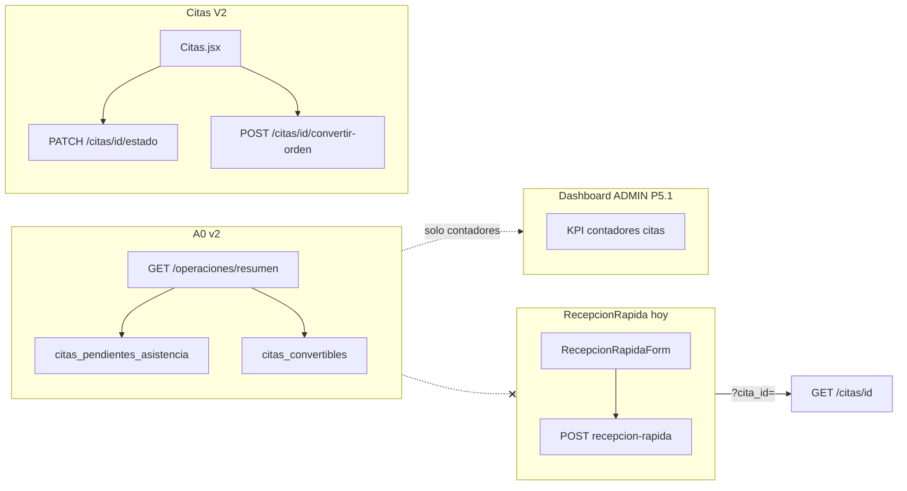
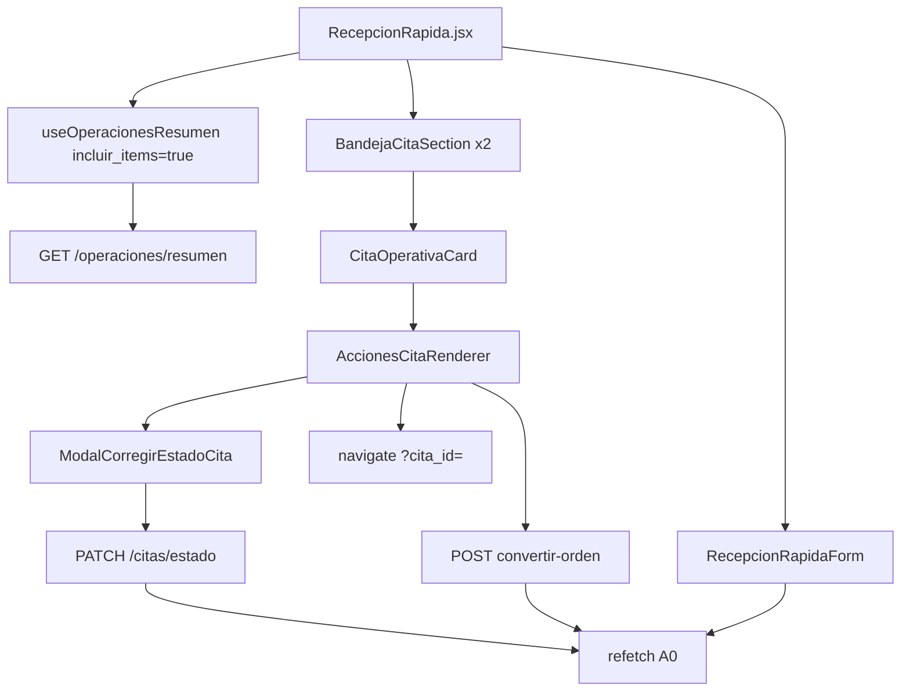

# PLAN P5.2 — RECEPCIÓN OPERATIVA ENRIQUECIDA

**Versión:** 1.0  
**Fecha:** Junio 2026  
**Estado:** 📋 **PLAN APROBADO PARA IMPLEMENTACIÓN** — implementación pendiente de autorización explícita  
**Baseline HEAD:** `d06365fee9286eaf82d6605392d69f2c085682fc`  
**Baseline funcional P5.1:** `1bb7f9d815795209db29222126776a4e68059701`  
**Contrato vigente:** A0 v2 (`meta.version_contrato = "a0-v2"`)

**Relacionado:**

- [PLAN_P5_DASHBOARD_POR_ROL.md](./PLAN_P5_DASHBOARD_POR_ROL.md)
- [CIERRE_P5_1_DASHBOARD_POR_ROL.md](./CIERRE_P5_1_DASHBOARD_POR_ROL.md)
- [ARQUITECTURA_OPERATIVA_V2.md](./ARQUITECTURA_OPERATIVA_V2.md)
- [METODOLOGIA_DESARROLLO_V2.md](./METODOLOGIA_DESARROLLO_V2.md)

---

## Decisión arquitectónica

### Por qué se eligió C1 (Recepción enriquecida con bandejas citas A0)

Tras el PRE-CHECK P5.2, el candidato **C1** concentra el mayor ROI operativo con el menor riesgo técnico:

| Factor | C1 |
|--------|-----|
| **Dolor real** | Smoke P5.1 en prod mostró citas sin asistencia y convertibles; Recepción hoy es solo formulario |
| **Flujo A** | Cierra el hueco cita → recepción → OT en la superficie donde trabaja mostrador (ADMIN/CAJA/EMPLEADO) |
| **Backend listo** | A0 v2 ya expone `citas_pendientes_asistencia` y `citas_convertibles` con ítems y `acciones[]` para `ROLES_RECEPCION` |
| **Alcance acotado** | Frontend-only; reutiliza patrones Mi Taller / Caja (bandejas + tarjetas + evaluador) |
| **EMPLEADO** | Landing P5.1 es `/operaciones/recepcion`; sin bandejas la landing queda incompleta |

### Por qué se descartó C2 (Dashboard resumen CAJA en `/`)

| Factor | C2 descartado en P5.2 |
|--------|------------------------|
| **Decisión P5.1** | CAJA aterriza en `/operaciones/caja` por diseño; KPIs financieros no son trabajo diario de mostrador |
| **Prioridad negocio** | El dolor medido está en recepción/citas, no en falta de tablero financiero para CAJA |
| **Riesgo UX** | Reintroducir `/` para CAJA compite con guard P5.1 y confunde nav «Dashboard» |
| **Backlog** | C2 permanece como **P5.2b** opcional si negocio lo solicita explícitamente |

Otros candidatos del PRE-CHECK quedan fuera de P5.2: **C3** nav UX (backlog), **C4** Flujo B refacciones (fase posterior), **C5** smoke EMPLEADO (criterio de aceptación, no entregable único).

### Por qué no requiere backend

| Capacidad | Estado |
|-----------|--------|
| Bandejas citas en A0 | ✅ Implementado en `operaciones_service.py` |
| Acciones `marcar_asistencia_cita`, `convertir_cita_ot` | ✅ Evaluador en A0 |
| Mutaciones | ✅ Delegadas a `PATCH /api/citas/{id}/estado`, `POST /api/citas/{id}/convertir-orden`, recepción rápida |
| Params `incluir_items=true` | ✅ Soportado en contrato A0 v2 |

**Gap detectado:** solo **frontend** — no existe UI de bandejas citas en Recepción ni `AccionesCitaRenderer`. No se identifica gap de endpoint, schema ni migración.

### Cómo preserva A0 v2

```text
Backend == A0 == acciones[] == UI
```

- La UI **lee** `GET /api/operaciones/resumen` con `incluir_items=true` solo en Recepción.
- Visibilidad y habilitación de botones desde `acciones[].permitida` — **sin** `if (rol && estado)` local.
- Mutaciones vía endpoints existentes (Citas V2, recepción rápida) — A0 no escribe en BD.
- Dashboard ADMIN P5.1 mantiene query **ligera** (`incluir_items=false`) — sin duplicar bandejas.
- Caja Operativa y Mi Taller **sin cambios**.

---

## Resumen ejecutivo

P5.2 completa la superficie **Centro Operativo → Recepción** (`/operaciones/recepcion`), hoy reducida a un formulario de recepción rápida. A0 v2 ya expone bandejas `citas_pendientes_asistencia` y `citas_convertibles` con ítems, `acciones[]` y `estado_meta` para roles de recepción (ADMIN, CAJA, EMPLEADO), pero esa información no se muestra en la pantalla operativa del mostrador.

El hito es **frontend-only**: integrar A0 con `incluir_items=true` en Recepción, reutilizar patrones de Mi Taller/Caja (bandejas + tarjetas + acciones gobernadas por evaluador), y enlazar CTAs a flujos Citas V2 / recepción existentes sin reimplementar lógica de estados ni modificar contrato A0.

---

## Baseline

| Campo | Valor |
|-------|-------|
| **HEAD** | `d06365fee9286eaf82d6605392d69f2c085682fc` |
| **P5.1 funcional** | `1bb7f9d815795209db29222126776a4e68059701` |
| **P5.1 documental** | `c011e9a6151e95bfd50743db94b224aa8e14add2` |
| **Metodología PRE-CHECK** | `d06365f` |
| **CI** | Run #320 SUCCESS |
| **Contrato** | A0 v2 |
| **Landing recepción** | ADMIN / CAJA / EMPLEADO → `/operaciones/recepcion` (P5.1) |
| **Smoke P5.1** | EMPLEADO no validado en prod (0 usuarios) — criterio P5.2 |

---

## Problema

| Síntoma | Evidencia |
|---------|-----------|
| Recepción = solo formulario | `RecepcionRapida.jsx` no usa `useOperacionesResumen` |
| Bandejas citas A0 sin UI operativa | A0 devuelve ítems cita con `acciones[]`; solo contadores en dashboard ADMIN |
| Flujo cita→OT fragmentado | Operador debe ir a `/citas` o usar `?cita_id=` manualmente |
| EMPLEADO sin contexto operativo | Landing recepción sin bandejas; rol no probado en prod |
| Alertas reales | Smoke P5.1 prod: citas sin asistencia y convertibles en A0 ADMIN |

**Solapamiento A0 (documentado):** una cita `CONFIRMADA` con hora pasada puede aparecer en ambas bandejas. La UI muestra dos secciones sin deduplicar — coherente con backend actual.

**Fuera del problema P5.2 v1:** bandejas OT para EMPLEADO en A0 — excluidas.

---

## Objetivo

Enriquecer `/operaciones/recepcion` con **bandejas operativas de citas** alimentadas por A0 v2, permitiendo al mostrador:

1. Ver citas que requieren **marcar asistencia**.
2. Ver citas **convertibles** a OT / recepción.
3. Actuar vía **CTAs y acciones A0** sin duplicar reglas de negocio en frontend.

**Éxito:** Recepción al mismo nivel operativo que Mi Taller (P3.1) y Caja Operativa (P4.x).

---

## Alcance incluido

### 1. Bandeja «Citas pendientes de asistencia»

| Aspecto | Detalle |
|---------|---------|
| **Fuente A0** | `bandejas.citas_pendientes_asistencia` |
| **Contenido ítem** | `id`, `fecha_hora`, `cliente_nombre`, `vehiculo_resumen`, `estado`, `estado_meta`, `acciones[]` |
| **CTA** | Marcar asistencia vía `ModalCorregirEstadoCita` + `PATCH /api/citas/{id}/estado` y/o enlace a `/citas` |
| **Regla** | Visibilidad desde `acciones[].permitida` — no lógica local de estado/rol |

### 2. Bandeja «Citas convertibles»

| Aspecto | Detalle |
|---------|---------|
| **Fuente A0** | `bandejas.citas_convertibles` |
| **CTA preferido** | `/operaciones/recepcion?cita_id={id}` (flujo P1/P2 existente) |
| **CTA alternativo** | `POST /api/citas/{id}/convertir-orden` cuando `convertir_cita_ot` permitida |
| **Regla** | Gobernanza `acciones[]`; `motivo_bloqueo` visible si bloqueada |

### 3. Integración A0 en Recepción

```http
GET /api/operaciones/resumen?limit_items=30&incluir_items=true
```

- `useOperacionesResumen(30, { incluirItems: true })`
- `refetch` tras mutación (patrón Mi Taller / Caja)
- Sin cambios en dashboard ADMIN (`incluir_items=false`)

### 4. Roles

| Rol | Acceso |
|-----|--------|
| ADMIN | ✅ |
| CAJA | ✅ |
| EMPLEADO | ✅ (validar con usuario prod) |
| TECNICO | ❌ (redirect existente) |

### 5. Componentes nuevos (mínimos)

| Componente | Responsabilidad |
|------------|-----------------|
| `BandejaCitaSection` | Espejo `BandejaOtSection` |
| `CitaOperativaCard` | Tarjeta desde ítem A0 |
| `AccionesCitaRenderer` | Botones desde `acciones[]` |

### 6. Layout UX

```
[PageHeader Recepción rápida]
[Bandeja: Citas sin asistencia (N)]
[Bandeja: Citas convertibles (N)]
[Formulario recepción rápida — sin cambio funcional core]
```

---

## Alcance excluido

| Exclusión | Notas |
|-----------|-------|
| Dashboard CAJA en `/` | P5.2b / backlog negocio |
| `/operaciones/refacciones` | Flujo B — fase posterior |
| Corrección turno caja ADMIN vs CAJA | P5.1-OBS-001 |
| Rediseño nav global (P5-UX-001) | Backlog |
| Backend / A0 / endpoints nuevos | Salvo gap demostrado (ninguno en v1) |
| Alembic | ❌ |
| Bandejas OT en Recepción (EMPLEADO) | Fuera v1 |
| Cambios P4.x / P5.1 | ❌ |
| KPIs financieros | ❌ |
| Playwright / E2E | P5.4 |
| Bandejas citas en dashboard ADMIN | ❌ |
| Reimplementar máquina de estados citas | ❌ |

---

## Arquitectura actual



**Mutaciones existentes (reutilizar):**

| Acción A0 | API / UI |
|-----------|----------|
| `marcar_asistencia_cita` | `PATCH /api/citas/{id}/estado` + `ModalCorregirEstadoCita` |
| `convertir_cita_ot` | `POST /api/citas/{id}/convertir-orden` o recepción `?cita_id=` |

---

## Arquitectura propuesta



**Reglas:**

1. Una query A0 por pantalla Recepción.
2. Acciones gobernadas por `acciones[]` del ítem A0.
3. Sin lógica paralela de elegibilidad en frontend.
4. Formulario walk-in permanece debajo de bandejas.

---

## Archivos candidatos

| Archivo | Cambio |
|---------|--------|
| `frontend/src/pages/operaciones/RecepcionRapida.jsx` | Integrar A0, bandejas, refetch |
| `frontend/src/components/operaciones/BandejaCitaSection.jsx` | **Nuevo** |
| `frontend/src/components/operaciones/CitaOperativaCard.jsx` | **Nuevo** |
| `frontend/src/components/operaciones/AccionesCitaRenderer.jsx` | **Nuevo** |
| `frontend/src/utils/accionesCitaApi.js` | **Nuevo** (opcional) |
| `frontend/src/components/operaciones/ModalCorregirEstadoCita.jsx` | Reutilizar |
| `frontend/src/hooks/useOperacionesResumen.js` | Sin cambio de contrato |
| `frontend/src/utils/citaOt.js` | Reutilizar |
| `frontend/src/utils/citaEstados.js` | Reutilizar |

**Sin tocar:** `Dashboard.jsx`, `CajaOperativa.jsx`, `MiTaller.jsx`, backend A0.

---

## Contrato A0

### Bandejas consumidas

| Clave | Métrica | Roles |
|-------|---------|-------|
| `citas_pendientes_asistencia` | `metricas.citas_pendientes_asistencia` | ADMIN, CAJA, EMPLEADO |
| `citas_convertibles` | `metricas.citas_convertibles` | ADMIN, CAJA, EMPLEADO |

### Forma ítem cita

```json
{
  "tipo_entidad": "cita",
  "id": 123,
  "fecha_hora": "...",
  "estado": "CONFIRMADA",
  "cliente_nombre": "...",
  "vehiculo_resumen": "...",
  "estado_meta": { "transiciones_permitidas": [] },
  "evaluacion_conversion": { "convertible": true, "motivo": null },
  "acciones": [
    { "accion": "marcar_asistencia_cita", "permitida": true },
    { "accion": "convertir_cita_ot", "permitida": true }
  ]
}
```

### Params Recepción

| Param | Valor |
|-------|-------|
| `limit_items` | `30` |
| `incluir_items` | `true` |

**Gap backend:** ninguno para P5.2 v1.

---

## UX esperada

### Bandeja «Sin asistencia»

- Título + contador `(N)`.
- Tarjeta: fecha, cliente, vehículo, badge estado.
- **Marcar asistencia** → modal Citas V2.
- Link secundario: **Ver en Citas**.

### Bandeja «Convertibles»

- **Completar recepción** → `?cita_id=` + formulario precargado.
- **Convertir a OT** (si permitida) → redirect detalle OT.

### Estados vacíos / errores

- Mensaje por bandeja vacía (patrón `BandejaOtSection`).
- Fallo A0: banner degradado; formulario walk-in usable.
- Acción bloqueada: `motivo_bloqueo` visible.

---

## Roles y permisos

| Rol | Ruta | Bandejas | Formulario |
|-----|------|----------|------------|
| ADMIN | ✅ | ✅ citas | ✅ |
| CAJA | ✅ | ✅ citas | ✅ |
| EMPLEADO | ✅ | ✅ citas | ✅ |
| TECNICO | ❌ redirect | ❌ | ❌ |

Guard `ROLES_RECEPCION` en `RecepcionRapida.jsx` — mantener.

---

## Criterios de aceptación

### Funcionales

| # | Criterio |
|---|----------|
| F1 | ADMIN ve 2 bandejas citas cuando A0 tiene datos |
| F2 | CAJA ve bandejas y puede actuar |
| F3 | EMPLEADO validado en prod ve bandejas + formulario |
| F4 | Ítems desde `bandejas.*.items` — sin listado Citas paralelo |
| F5 | Botones respetan `acciones[].permitida` |
| F6 | Refetch A0 tras marcar asistencia / convertir / recepción |
| F7 | `?cita_id=` precarga formulario (regresión P1/P2) |
| F8 | Walk-in sin cita funciona |

### No regresión

| # | Superficie |
|---|------------|
| R1 | Dashboard ADMIN P5.1 |
| R2 | Caja Operativa P4.2 |
| R3 | Mi Taller P3.1 |
| R4 | Landing por rol P5.1 |

### Técnicos

| # | Criterio |
|---|----------|
| T1 | `npm run build` PASS |
| T2 | `pytest tests/test_operaciones_resumen.py -v` PASS |
| T3 | Recepción Network: `incluir_items=true` |
| T4 | Dashboard ADMIN Network: `incluir_items=false` |

---

## Smoke plan

### Automático

| Check | Comando |
|-------|---------|
| Build | `cd frontend && npm run build` |
| Import | `python -c "from app.main import app; print('OK')"` |
| A0 | `pytest tests/test_operaciones_resumen.py -v` |
| Suite | `pytest tests/ -q` |
| Lint | `ruff check app tests` · `black --check app tests` |

### Manual (por rol)

| # | Escenario |
|---|-----------|
| M1 | ADMIN → Recepción → bandejas + formulario |
| M2 | CAJA → idem |
| M3 | EMPLEADO → idem (usuario prod) |
| M4 | Cita convertible → CTA recepción |
| M5 | Cita sin asistencia → marcar → refetch |
| M6 | Dashboard ADMIN sin bandejas |
| M7 | Caja Operativa P4.2 intacta |

---

## Riesgos

| ID | Riesgo | Prob. | Impacto | Mitigación |
|----|--------|-------|---------|------------|
| R1 | Duplicar lógica Citas.jsx | Media | Alto | AccionesCitaRenderer + modales existentes |
| R2 | Ítem en ambas bandejas | Alta | Bajo | Documentado; OK operativo |
| R3 | Modal necesita GET cita extra | Media | Medio | Spike fase 0; ítem A0 trae `estado_meta` |
| R4 | Layout largo móvil | Media | Medio | Scroll natural; colapsables backlog |
| R5 | EMPLEADO sin usuario prod | Alta | Medio | Crear usuario antes smoke |
| R6 | Regresión walk-in | Baja | Alto | No alterar `RecepcionRapidaForm` core |
| R7 | Confusión convertir vs recepción | Media | Medio | Copy UI claro |

---

## Fases de implementación sugeridas

| Fase | Entregable | Est. |
|------|------------|------|
| 0 | Spike Modal + ítem A0 | 0.5d |
| 1 | Componentes bandeja cita | 1d |
| 2 | Integración RecepcionRapida | 1d |
| 3 | QA build + pytest + smoke manual | 0.5d |
| 4 | `CIERRE_P5_2_RECEPCION_OPERATIVA.md` | 0.5d |

**Total:** **M** (~3 días)

**Commits sugeridos (separados):**

1. `feat(p5.2): componentes bandeja cita operativa`
2. `feat(p5.2): integrar bandejas A0 en recepcion rapida`
3. `docs: close P5.2 recepcion operativa`

---

## Rollback

| Criterio | Acción |
|----------|--------|
| Recepción rota | `git revert <sha_p5.2_feature>` |
| Sin rollback BD | Frontend-only |

---

## Veredicto

| Campo | Valor |
|-------|-------|
| **Plan** | ✅ Aprobado para implementación |
| **Implementación código** | 🔲 Pendiente autorización explícita del usuario |
| **Gap backend** | Ninguno v1 |
| **Complejidad** | M (frontend) |

---

*Plan P5.2 — Recepción Operativa Enriquecida. Documento oficial. Sin implementación en este hito.*
