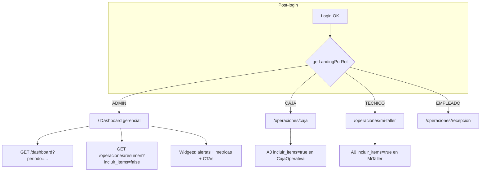
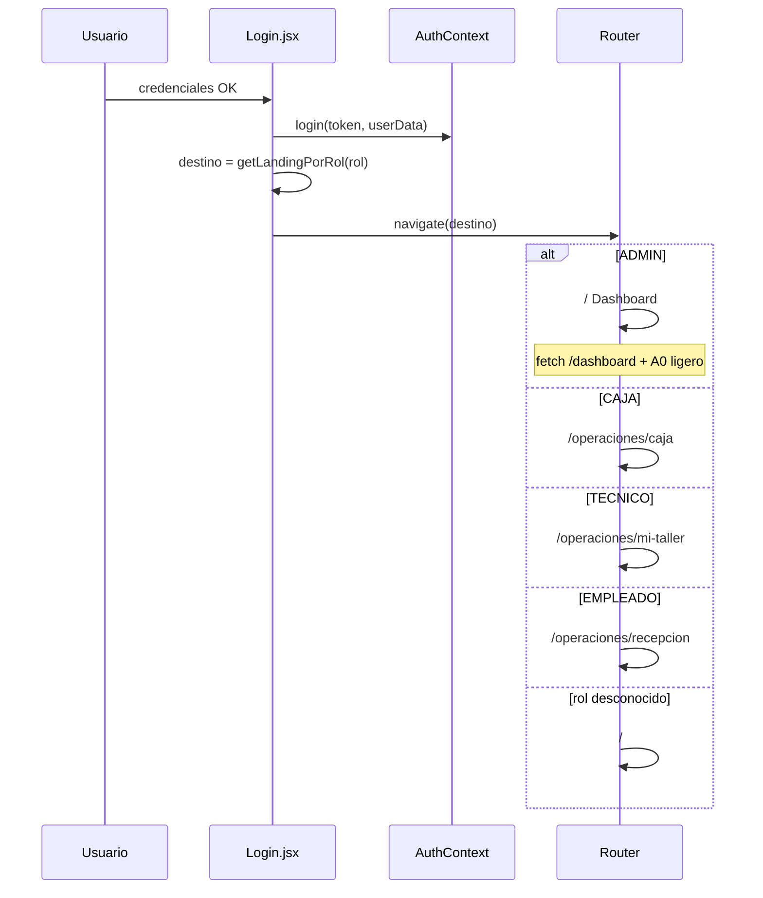

# PLAN P5 — Dashboard por Rol (P5.1 MVP)

**Versión:** 1.0  
**Fecha:** 12 de junio de 2026  
**Estado:** 📋 **APROBADO ARQUITECTÓNICAMENTE (PRE-CHECK)** — pendiente implementación P5.1  
**Baseline:** SHA `58061b0` · A0 v2 · P4.0–P4.2 congelados · CI/Railway verdes  

**Relacionado:**

- [CIERRE_RELEASE_P41_CAJA_OPERATIVA.md](./CIERRE_RELEASE_P41_CAJA_OPERATIVA.md)
- [CIERRE_P42_FLUJO_GUIADO_CAJA.md](./CIERRE_P42_FLUJO_GUIADO_CAJA.md)
- [ARQUITECTURA_OPERATIVA_V2.md](./ARQUITECTURA_OPERATIVA_V2.md)
- [PLAN_A0_CAPA_OPERATIVA_CENTRAL.md](./PLAN_A0_CAPA_OPERATIVA_CENTRAL.md)
- [METODOLOGIA_DESARROLLO_V2.md](./METODOLOGIA_DESARROLLO_V2.md) — Principio 10 (Dashboard orientado por rol)

---

## Veredicto arquitectónico

| Criterio | Decisión |
|----------|----------|
| **Dirección P5** | ✅ **GO** — landing por rol + widgets A0 ligeros en dashboard ADMIN |
| **PRE-CHECK P5** | ✅ Aprobado |
| **Implementación P5.1** | ✅ **GO** bajo restricciones de este plan |
| **Extensión A0 / endpoints / Alembic** | 🔲 **Fuera de P5.1** — backlog P5.3 |

### Decisiones congeladas para P5.1

| Decisión | Valor |
|----------|-------|
| Modificar A0 | ❌ No |
| Crear endpoints | ❌ No |
| Alembic | ❌ No |
| Playwright E2E | ❌ No (P5.4) |
| Métricas nuevas en backend | ❌ No |
| Duplicar bandejas en UI | ❌ No |
| Modo ligero A0 en dashboard | ✅ `incluir_items=false` |
| ADMIN post-login | ✅ Mantiene `/` (dashboard gerencial enriquecido) |
| CAJA post-login | ✅ Aterriza en `/operaciones/caja` |
| TECNICO post-login | ✅ Aterriza en `/operaciones/mi-taller` |
| EMPLEADO post-login | ✅ Aterriza en `/operaciones/recepcion` |
| Rol desconocido | ✅ Fallback `/` |

---

## 1. Objetivo del hito

### 1.1 Problema

Tras P4.2, el sistema operativo (Mi Taller, Caja Operativa, Recepción) está desplegado y gobernado por A0 v2, pero **todos los roles aterrizan en `/`** tras login. El dashboard actual:

- Mezcla KPIs financieros (`GET /dashboard`) con necesidades operativas distintas por rol.
- **No consume** `metricas` ni `alertas_operativas` de A0.
- Obliga a CAJA y TECNICO a un paso extra antes de su trabajo diario.
- Contradice Metodología V2 Principio 10: *«1 landing por rol»*.

### 1.2 Objetivo P5.1

Entregar **navegación post-login orientada por rol** y un **dashboard gerencial ADMIN** enriquecido con resumen operativo A0 **ligero**, sin duplicar bandejas ni alterar backend.

**Principio preservado:**

```text
Backend == A0 == acciones[] == UI
```

P5.1 solo **lee** A0 y `/dashboard`; no evalúa permisos de negocio en frontend más allá de routing y composición de widgets.

### 1.3 Qué NO es P5.1

| No es | Dueño actual |
|-------|--------------|
| Nuevo módulo de cobro o entrega | Caja Operativa P4 |
| Reemplazo de Mi Taller o Recepción | P3 / P1 |
| Unificación de `/dashboard` y A0 en un solo endpoint | Fuera de alcance |
| Tablero financiero completo para CAJA en `/` | CAJA va directo a operación |
| Suite E2E Playwright | P5.4 |

---

## 2. Alcance P5.1 MVP

| # | Entregable | Descripción |
|---|------------|-------------|
| 1 | **`getLandingPorRol(rol)`** | Utilidad central en `rolesOperaciones.js` |
| 2 | **Redirect post-login** | `Login.jsx` usa landing por rol (reemplaza `navigate('/')` fijo) |
| 3 | **Hook A0 ligero** | Extender `useOperacionesResumen` con params `incluirItems`, `limitItems` |
| 4 | **Widgets dashboard** | `KPIWidget.jsx`, `AlertasOperativasBanner.jsx` (o equivalente mínimo) |
| 5 | **Dashboard ADMIN** | Enriquecer `Dashboard.jsx`: alertas A0 + KPIs operativos (contadores) + CTAs a operaciones; mantiene bloque financiero `/dashboard` |
| 6 | **Guard opcional en `/`** | Si CAJA/TECNICO llegan manualmente a `/`, redirect a su landing (defensa en profundidad) |
| 7 | **Tests** | Regresión manual/script; sin Playwright; validar imports y build frontend |
| 8 | **Documentación cierre** | Tras implementación: `CIERRE_P5_DASHBOARD.md` (fuera de P5.1 plan, hito posterior) |

### 2.1 Entregables por archivo (estimación)

| Archivo | Cambio |
|---------|--------|
| `frontend/src/utils/rolesOperaciones.js` | `LANDING_POR_ROL`, `getLandingPorRol()` |
| `frontend/src/pages/Login.jsx` | Redirect post-login |
| `frontend/src/hooks/useOperacionesResumen.js` | Params `incluirItems`, query key |
| `frontend/src/pages/Dashboard.jsx` | Sección operativa A0 (solo ADMIN) |
| `frontend/src/components/dashboard/KPIWidget.jsx` | **Nuevo** |
| `frontend/src/components/dashboard/AlertasOperativasBanner.jsx` | **Nuevo** |
| `frontend/src/components/dashboard/DashboardOperativoSection.jsx` | **Nuevo** (opcional, agrupa widgets) |
| `frontend/src/App.jsx` o `Dashboard.jsx` | Redirect guard CAJA/TECNICO |

**Backend:** ningún archivo.

---

## 3. Fuera de alcance

Explícitamente **excluido** de P5.1:

- Modificar `app/services/operaciones_service.py` (A0).
- Nuevo router o endpoint (`/dashboard/operativo`, etc.).
- Migraciones Alembic.
- Playwright / Cypress E2E.
- Nuevas claves en `metricas` o códigos en `alertas_operativas`.
- Renderizar ítems de bandejas O1/O2/V1 en dashboard (solo contadores).
- Dashboard financiero dedicado para CAJA en `/`.
- Refactor del módulo `/caja` (turnos legacy).
- Cambios en Mi Taller, Caja Operativa o wizard P4.2.
- Actualización de docs maestros (`METODOLOGIA_*`, `ARQUITECTURA_*`) — hito documental posterior.

**Backlog P5.2+:** dashboard CAJA opcional en `/`, métricas A0 extendidas (P5.3), Playwright (P5.4).

---

## 4. Arquitectura aprobada

### 4.1 Modelo C híbrido (PRE-CHECK aprobado)

**Landing dinámica por permisos** + **composición de widgets** en dashboard ADMIN.



### 4.2 Dos capas de datos (complementarias)

| Capa | Endpoint | Uso P5.1 |
|------|----------|----------|
| **Operativa** | `GET /api/operaciones/resumen` | ADMIN: `incluir_items=false` → `metricas`, `alertas_operativas`, `caja`, `acciones_globales` |
| **Financiera** | `GET /api/dashboard` | ADMIN: KPIs existentes (ventas periodo, inventario, etc.) |

No fusionar respuestas en backend. El frontend compone dos queries independientes en `Dashboard.jsx`.

### 4.3 Reglas de UI

1. **Contadores, no bandejas:** widgets muestran números y enlaces; detalle vive en `/operaciones/*`.
2. **CTAs desde A0 o nav existente:** no inventar acciones; usar rutas ya autorizadas por rol.
3. **Sin lógica `if rol && estado OT`:** permisos de ítem siguen en pantallas operativas.
4. **Reutilizar** `TurnoCajaBanner`, `PageHeader`, `PageLoading`, patrones P3/P4.

---

## 5. Landing por rol

### 5.1 ADMIN

| Campo | Valor |
|-------|-------|
| **Landing** | `/` |
| **Pantalla** | `Dashboard.jsx` — gerencial + operativo |
| **Datos** | `/dashboard` + A0 ligero |
| **Rationale** | Supervisión global: finanzas + alertas operativas + acceso a todas las operaciones vía nav |

**Widgets operativos sugeridos (contadores A0):**

- `citas_pendientes_asistencia`, `citas_convertibles`
- `ot_pendientes`, `ot_en_proceso`, `ot_completadas`
- `ot_pendientes_cobro`, `ot_listas_entrega`, `ventas_saldo_pendiente`
- Banner `alertas_operativas[]`
- Bloque `caja` (turno abierto, alerta turno largo) — reutilizar patrón `TurnoCajaBanner` o widget compacto

**CTAs (enlaces, no modales):**

- `/operaciones/recepcion`, `/operaciones/caja`, `/operaciones/mi-taller`, `/citas`

### 5.2 CAJA

| Campo | Valor |
|-------|-------|
| **Landing** | `/operaciones/caja` |
| **Pantalla** | `CajaOperativa.jsx` (existente P4.1/P4.2) |
| **Datos** | A0 completo ya cargado en esa página |
| **Rationale** | Trabajo diario = cobro/entrega; evitar dashboard gerencial |

**Comportamiento adicional P5.1:**

- Si navega a `/` manualmente → redirect a `/operaciones/caja`.
- Nav lateral mantiene enlace «Dashboard»; opcional: renombrar label a «Resumen» solo para ADMIN (backlog UX, no bloqueante).

### 5.3 TECNICO

| Campo | Valor |
|-------|-------|
| **Landing** | `/operaciones/mi-taller` |
| **Pantalla** | `MiTaller.jsx` (existente P3.1) |
| **Datos** | A0 filtrado por `tecnico_id` en backend |
| **Rationale** | Trabajo diario = OT propias; dashboard `/` actual casi vacío |

**Comportamiento adicional P5.1:**

- Si navega a `/` manualmente → redirect a `/operaciones/mi-taller`.
- No mostrar KPIs financieros ni bandejas O1/O2/V1 (backend ya devuelve 0).

### 5.4 EMPLEADO — decisión aprobada

| Campo | Valor |
|-------|-------|
| **Landing** | `/operaciones/recepcion` |
| **Pantalla** | `RecepcionRapida.jsx` (existente P1) |
| **Datos** | A0 bandejas de citas en esa superficie; sin financiero ni OT operativas |
| **Rationale** | Alineado con `ROLES_RECEPCION`; única operación central V2 autorizada para EMPLEADO |

**Comportamiento adicional P5.1:**

- Si navega a `/` manualmente → redirect a `/operaciones/recepcion`.
- Nav lateral mantiene acceso a módulos legacy según permisos actuales.

### 5.5 Tabla consolidada — landing por rol (decisión final)

| Rol | Landing post-login | Redirect si visita `/` |
|-----|-------------------|------------------------|
| ADMIN | `/` | — (permanece) |
| CAJA | `/operaciones/caja` | → caja |
| TECNICO | `/operaciones/mi-taller` | → mi-taller |
| EMPLEADO | `/operaciones/recepcion` | → recepción |
| Rol desconocido | `/` | — |

**Implementación P5.1:**

```javascript
// rolesOperaciones.js
const LANDING_POR_ROL = {
  ADMIN: '/',
  CAJA: '/operaciones/caja',
  TECNICO: '/operaciones/mi-taller',
  EMPLEADO: '/operaciones/recepcion',
}

export function getLandingPorRol(rol) {
  return LANDING_POR_ROL[rol] ?? '/'
}
```

**A0 para EMPLEADO:** ve bandejas de citas (`citas_pendientes_asistencia`, `citas_convertibles`); no ve financiero ni OT operativas — coherente con recepción como landing.

---

## 6. Componentes reutilizables

| Componente | Ubicación | Uso P5.1 |
|------------|-----------|----------|
| `PageHeader` | `components/PageHeader.jsx` | Dashboard ADMIN |
| `PageLoading` | `components/PageLoading.jsx` | Estados carga dual query |
| `TurnoCajaBanner` | `components/operaciones/TurnoCajaBanner.jsx` | Widget caja ADMIN (compacto o embed) |
| `useApiQuery` | `hooks/useApi.js` | Patrón queries |
| `useOperacionesResumen` | `hooks/useOperacionesResumen.js` | Extender params |
| `puedeRecepcionRapida`, etc. | `utils/rolesOperaciones.js` | CTAs y guards |
| `formatearFechaHora` | `utils/fechas.js` | Si se muestran timestamps en alertas |

### 6.1 Componentes nuevos (mínimos)

| Componente | Responsabilidad |
|------------|-----------------|
| `KPIWidget` | Tarjeta contador + label + opcional `Link` destino |
| `AlertasOperativasBanner` | Lista `alertas_operativas[]` por severidad |
| `DashboardOperativoSection` | Agrupa KPIs operativos + alertas (opcional) |

**Prohibido en P5.1:** copiar `BandejaOtSection`, `AccionesCajaRenderer` o modales P4 al dashboard.

---

## 7. Endpoints reutilizados

| Método | Ruta | Rol | Params P5.1 | Campos consumidos |
|--------|------|-----|-------------|-------------------|
| GET | `/api/operaciones/resumen` | Autenticado | `incluir_items=false`, `limit_items=1` | `metricas`, `alertas_operativas`, `caja`, `acciones_globales`, `meta.version_contrato` |
| GET | `/api/dashboard` | ADMIN (y CAJA si accede a `/`) | `periodo=mes` | Payload actual sin cambios |
| POST | `/api/auth/login` | Público | — | JWT con `rol` (sin cambios) |

**No usar en P5.1 para dashboard:** POST mutaciones, detalle OT, pagos, ventas.

**Validación contrato:** assert `meta.version_contrato === 'a0-v2'` en desarrollo (consola/test manual).

---

## 8. Flujo de navegación post-login



### 8.1 Matriz landing

Ver tabla consolidada §5.5. Resumen nav «Dashboard»:

| Rol | Nav «Dashboard» (`/`) |
|-----|------------------------|
| ADMIN | Dashboard gerencial |
| CAJA | Redirect → caja |
| TECNICO | Redirect → mi-taller |
| EMPLEADO | Redirect → recepción |

### 8.2 Deep links y bookmark

- URLs operativas existentes siguen válidas.
- `/` permanece URL canónica del dashboard ADMIN.

---

## 9. Riesgos

| ID | Riesgo | Prob. | Impacto | Mitigación |
|----|--------|-------|---------|------------|
| R1 | Duplicar bandejas en dashboard | Media | Alto | Solo contadores; `incluir_items=false` |
| R2 | Condicionales `rol` dispersos | Media | Medio | Centralizar en `getLandingPorRol` + un guard en `Dashboard.jsx` |
| R3 | CAJA pierde acceso rápido a KPIs ventas | Baja | Bajo | Nav a `/ventas`, `/dashboard` bloqueado o redirect |
| R4 | Doble fetch A0 (Dashboard + operaciones) | Baja | Bajo | Query keys distintas; staleTime 15–45s |
| R5 | Regresión en flujo recepción EMPLEADO | Baja | Medio | Smoke manual post-login; rollback parcial §13.3 |
| R6 | Confusión `/dashboard` vs operaciones | Media | Medio | Copy UI: «Resumen gerencial» vs «Caja operativa» |
| R7 | Regresión login / rutas protegidas | Baja | Alto | Checklist §11; build frontend |

---

## 10. Estrategia de pruebas

### 10.1 Sin Playwright (P5.1)

| Nivel | Qué | Cómo |
|-------|-----|------|
| **Build** | Frontend compila | `cd frontend && npm run build` |
| **Import/startup** | Backend intacto | `python -c "from app.main import app; print('OK')"` |
| **Regresión backend** | A0 sin cambios | `pytest tests/test_operaciones_resumen.py -v` |
| **Suite completa** | No romper P4 | `pytest tests/ -q` |
| **Lint** | Estilo | `ruff check app tests` · `black --check app tests` |
| **Manual por rol** | Landing + redirect | Tabla §11 |

### 10.2 Casos manuales mínimos

1. Login ADMIN → permanece en `/`; se ven KPIs financieros + sección operativa A0.
2. Login CAJA → `/operaciones/caja`; wizard P4.2 intacto.
3. Login TECNICO → `/operaciones/mi-taller`; bandejas OT propias.
4. Login EMPLEADO → `/operaciones/recepcion`.
5. CAJA navega a `/` → redirect caja.
6. TECNICO navega a `/` → redirect mi-taller.
7. EMPLEADO navega a `/` → redirect recepción.
8. A0 ligero: Network tab → `incluir_items=false`; payload sin arrays `items` poblados (o items vacíos).

### 10.3 Tests automatizados opcionales (no bloqueantes P5.1)

- Test unitario JS de `getLandingPorRol` si el proyecto adopta Vitest en el futuro.
- No añadir tests Python nuevos salvo regresión accidental en backend (no esperada).

---

## 11. Criterios de aceptación

### 11.1 Funcionales

- [ ] `getLandingPorRol` implementado y usado en `Login.jsx`.
- [ ] ADMIN: `/` muestra dashboard financiero **y** widgets operativos desde A0 (`incluir_items=false`).
- [ ] CAJA: post-login en `/operaciones/caja`.
- [ ] TECNICO: post-login en `/operaciones/mi-taller`.
- [ ] EMPLEADO: post-login en `/operaciones/recepcion`.
- [ ] Guard redirect en `/` para CAJA, TECNICO y EMPLEADO.
- [ ] No se renderizan bandejas completas (O1/O2/V1) en dashboard.
- [ ] Mi Taller, Caja Operativa, Recepción, wizard P4.2 **sin regresión** funcional.

### 11.2 No funcionales

- [ ] Cero cambios en `app/` backend.
- [ ] Cero migraciones Alembic.
- [ ] `meta.version_contrato === 'a0-v2'` en respuesta A0 del dashboard ADMIN.
- [ ] CI verde (lint, build-frontend, test).
- [ ] Railway auto-deploy success.

### 11.3 Pre-release opcional

- [ ] Walkthrough UI P4.2 recomendado (no bloqueante técnico P5.1).

---

## 12. Plan de despliegue

### 12.1 Secuencia implementación (orden sugerido)

| Paso | Tarea | Validación |
|------|-------|------------|
| 1 | `getLandingPorRol` + tests manuales login | 4 roles |
| 2 | Extender `useOperacionesResumen` | Network params |
| 3 | Widgets `KPIWidget`, `AlertasOperativasBanner` | Story manual en dev |
| 4 | Integrar en `Dashboard.jsx` (ADMIN) | Visual + dual fetch |
| 5 | Guard redirect `/` para CAJA, TECNICO y EMPLEADO | Manual |
| 6 | `npm run build` + pytest + ruff/black | CI local |
| 7 | Commit único o 2 commits (feat + docs) | PR opcional |
| 8 | Push `main` | CI #N |
| 9 | Railway auto-deploy | Health + smoke GET |

### 12.2 Commit sugerido (implementación)

```text
feat(p5.1): landing por rol y dashboard operativo admin
```

Documentación cierre (post-validación):

```text
docs: close P5.1 dashboard por rol
```

### 12.3 Smoke post-deploy (solo lectura)

| Check | Comando / acción |
|-------|------------------|
| Health | `GET /health` → 200 |
| build_rev | `GET /api/config` → SHA esperado |
| A0 ADMIN | JWT ADMIN → `GET /operaciones/resumen?incluir_items=false` |
| Login flows | Manual por rol en prod |

**No deploy manual** — Railway on push to `main`.

---

## 13. Rollback

### 13.1 Criterios de rollback

- Login roto para cualquier rol.
- Loop de redirects (`/` ↔ operaciones).
- Regresión en Caja Operativa o Mi Taller detectada en prod.
- CI rojo en `main` no resuelto en ventana acordada.

### 13.2 Procedimiento

| Paso | Acción |
|------|--------|
| 1 | `git revert <sha_p5.1>` en `main` (commit de feature frontend) |
| 2 | Push → Railway redeploy automático |
| 3 | Verificar login por rol (§5.5); ADMIN → `/`; CAJA/TECNICO/EMPLEADO → operaciones |
| 4 | Confirmar CI verde |
| 5 | Documentar incidente en issue / nota cierre |

### 13.3 Rollback parcial

Si solo falla landing EMPLEADO en producción:

- Hotfix: `EMPLEADO: '/'` en `LANDING_POR_ROL` (vuelve al comportamiento pre-P5.1 para ese rol) sin revert completo del hito.

### 13.4 Sin rollback de datos

P5.1 no toca BD → no hay rollback Alembic.

---

## Anexo A — Mapa de métricas A0 en widgets ADMIN

| Widget label | Métrica A0 | Link destino |
|--------------|------------|--------------|
| Citas sin asistencia | `citas_pendientes_asistencia` | `/citas` |
| Citas convertibles | `citas_convertibles` | `/operaciones/recepcion` |
| OT pendientes | `ot_pendientes` | `/operaciones/mi-taller` |
| OT en proceso | `ot_en_proceso` | `/operaciones/mi-taller` |
| OT completadas | `ot_completadas` | `/operaciones/mi-taller` |
| Por cobrar (O1) | `ot_pendientes_cobro` | `/operaciones/caja` |
| Listas entrega (O2) | `ot_listas_entrega` | `/operaciones/caja` |
| Ventas con saldo (V1) | `ventas_saldo_pendiente` | `/operaciones/caja` |
| Refacciones en compra | `refacciones_en_compra` | `/cotizaciones-refaccion` o inventario |
| Refacciones recibidas | `refacciones_recibidas_pendiente_entrega` | idem |

---

## Anexo B — Roadmap post P5.1

| Fase | Alcance |
|------|---------|
| **P5.2** | Dashboard resumen CAJA opcional en `/` (si negocio lo pide) |
| **P5.3** | Extensión A0: métricas OT sin ítems, alertas turno en array |
| **P5.4** | Playwright: login landing + smoke dashboard ADMIN |
| **P5.5** | `CIERRE_P5_DASHBOARD.md` + sync docs maestros |

---

## Anexo C — PRE-CHECK cumplimiento

| Regla | Cumple |
|-------|--------|
| Reutilización componentes | ✅ |
| No duplicar bandejas | ✅ |
| No modificar A0 P5.1 | ✅ |
| Principio 10 Metodología V2 | ✅ |
| Arquitectura Operativa V2 § P5 | ✅ |

---

*Plan P5.1 — generado tras PRE-CHECK aprobado. Sin implementación ni commit en este hito documental.*
