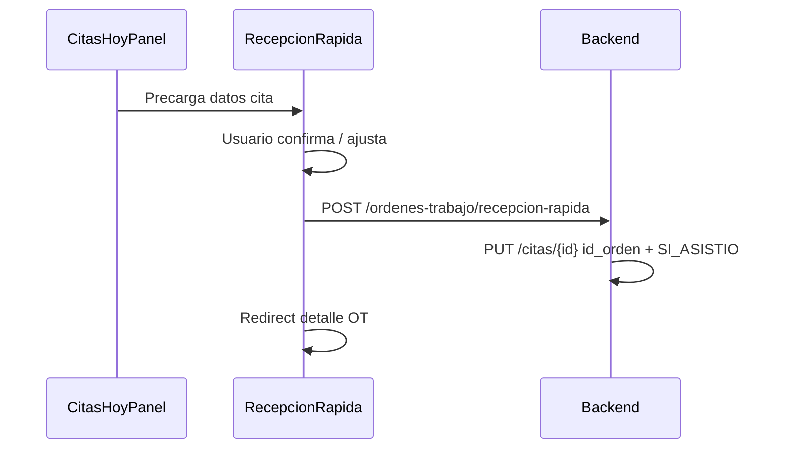

# Plan Recepción Rápida V2 — Análisis y diseño

**Versión:** 1.0  
**Fecha:** Junio 2026  
**Estado:** Análisis y diseño — **sin implementación**  
**Prioridad roadmap:** P1  
**Relacionado:** [METODOLOGIA_DESARROLLO_V2.md](./METODOLOGIA_DESARROLLO_V2.md) · [ARQUITECTURA_OPERATIVA_V2.md](./ARQUITECTURA_OPERATIVA_V2.md) · [MAPA_FLUJO_OPERATIVO.md](./MAPA_FLUJO_OPERATIVO.md) · [PLAN_DESIGN_SYSTEM.md](./PLAN_DESIGN_SYSTEM.md)

---

## Resumen ejecutivo

La recepción actual exige un **wizard de 4 pasos** y el backend **no permite** crear una OT sin servicios/repuestos, diagnóstico y observaciones completos. Eso impide cumplir la meta de **< 90 segundos** para un walk-in típico.

**Recepción Rápida V2** propone una pantalla única (`/operaciones/recepcion`) que captura solo lo esencial (cliente, vehículo, motivo, prioridad, técnico opcional) y crea una **OT mínima** en estado `PENDIENTE`, delegando ítems y cotización al técnico en **Mi Taller** (P3).

**Hallazgo crítico:** el backend actual **rechaza** OT sin servicios/repuestos (`POST /api/ordenes-trabajo/`). Se requiere un **nuevo contrato API** (endpoint dedicado o modo recepción) antes de que la UI pueda cumplir el objetivo operativo.

**Recomendación arquitectónica:** implementar `POST /api/ordenes-trabajo/recepcion-rapida` con validación relajada en creación y reglas reforzadas al **iniciar** o **enviar cotización** (no al crear).

**Complejidad estimada:** Media (5–8 días dev: 2 backend, 4 frontend, 1 QA/documentación).

---

## Fase 1 — Análisis del flujo actual

### 1.1 Punto de entrada actual

| Elemento | Valor |
|----------|-------|
| Ruta | `/ordenes-trabajo/nueva` |
| Componente | `frontend/src/pages/NuevaOrdenTrabajo.jsx` |
| Roles permitidos (UI) | Bloquea `TECNICO`; resto accede |
| Roles permitidos (API crear) | **Solo `ADMIN` y `CAJA`** (`app/routers/ordenes_trabajo/crud.py`) |
| Post-crear | Redirect a `/ordenes-trabajo` (listado) |

### 1.2 Wizard actual — 4 pasos

| Paso | Título | Campos / acciones | Validación para avanzar |
|------|--------|-------------------|------------------------|
| 1 | Cliente y vehículo | `ClienteAutocompleteConAltaRapida`, select vehículo, `ModalVehiculoRapido` | `cliente_id` + `vehiculo_id` |
| 2 | Asignación | Técnico, vendedor, prioridad | Siempre puede avanzar |
| 3 | Diagnóstico o servicio | `diagnostico_inicial`, `observaciones_cliente` (textarea) | Ambos obligatorios |
| 4 | Productos y servicios | Agregar servicios y/o repuestos (catálogo o libre) | ≥ 1 servicio o repuesto |

**Carga inicial:** `GET /config`, `GET /servicios/` (100), `GET /repuestos/` (500), `GET /usuarios/` — ~3–4 requests antes de interactuar.

### 1.3 Componentes ya reutilizables en paso 1

| Componente | Archivo | Función |
|------------|---------|---------|
| `ClienteAutocompleteConAltaRapida` | `frontend/src/components/ClienteAutocompleteConAltaRapida.jsx` | Búsqueda debounced `GET /clientes/?buscar=`, opción crear, integra modal |
| `ModalClienteRapido` | `frontend/src/components/ModalClienteRapido.jsx` | Alta rápida; valida duplicado teléfono 409 |
| `ModalVehiculoRapido` | `frontend/src/components/ModalVehiculoRapido.jsx` | `POST /vehiculos/`; auto-selección tras crear |
| Auto-apertura vehículo | Lógica en `NuevaOrdenTrabajo.jsx` | Tras cliente nuevo sin vehículos → abre modal |

**Gap en paso 1:** vehículo usa `<select>` nativo, no existe aún `VehiculoSelectorConAltaRapida` (selector + botón agregar unificado).

### 1.4 Flujos alternativos actuales (duplicación)

#### Clientes (`Clientes.jsx`)

- Modal completo CRUD cliente + modal vehículo inline
- Deep link `?nuevo=1`
- Export Excel, historial
- **No conectado** a creación OT directa

#### Vehículos (`Vehiculos.jsx`)

- CRUD completo con select de cliente
- Usado cuando recepción redirige fuera del flujo OT

#### Citas (`Citas.jsx`)

- Autocomplete cliente **manual** (carga 500 clientes al abrir modal)
- Modal vehículo **inline duplicado** (no usa `ModalVehiculoRapido`)
- Link a `/clientes?nuevo=1` si no existe cliente
- Campo `id_orden` en BD **sin conversión automática** a OT
- **Captura duplicada:** motivo cita ≠ diagnóstico OT

#### Ventas (`Ventas.jsx`)

- Select cliente estático (500 clientes precargados)
- Select vehículo dependiente
- Flujo independiente de OT (salvo `desde-orden`)

### 1.5 Conteo de pasos, clics y tiempo estimado

Escenarios medidos sobre el flujo **actual** (`/ordenes-trabajo/nueva`):

#### Escenario A — Cliente y vehículo existentes

| Métrica | Valor estimado |
|---------|----------------|
| Pasos wizard | 4 |
| Clics totales | 10–14 (navegar menú, buscar cliente, seleccionar vehículo, Siguiente ×3, agregar 1 servicio, Crear) |
| Campos obligatorios | 6+ (cliente, vehículo, diagnóstico, observaciones, ≥1 ítem) |
| Tiempo estimado | **3–4 minutos** (usuario experimentado) |
| Requests API (crear) | 1 × `POST /ordenes-trabajo/` |

#### Escenario B — Cliente nuevo + vehículo nuevo

| Métrica | Valor estimado |
|---------|----------------|
| Clics adicionales | +8–12 (crear cliente modal, crear vehículo modal, confirmaciones) |
| Tiempo estimado | **5–7 minutos** |
| Capturas duplicadas | Teléfono/nombre ya parseados en autocomplete (mejora reciente) |

#### Escenario C — Cliente con cita previa

| Métrica | Valor estimado |
|---------|----------------|
| Flujo actual | Cita → marcar asistencia → ir a OT nueva → **re-capturar todo** |
| Tiempo estimado | **4–6 minutos** |
| Duplicación | Cliente, vehículo, motivo (×2) |

**Conclusión:** el flujo actual **no puede** cumplir < 90 s sin cambio de alcance (OT mínima) y pantalla única.

### 1.6 Información capturada hoy vs. necesaria en recepción

| Campo | Wizard actual | Recepción ideal | ¿Duplicado después? |
|-------|---------------|-----------------|---------------------|
| Cliente | Paso 1 | Sí | No si reutiliza autocomplete |
| Vehículo | Paso 1 | Sí | No |
| Motivo | Pasos 3 (×2 campos) | 1 campo | Técnico amplía en diagnóstico |
| Diagnóstico inicial | Paso 3 obligatorio | Opcional / derivado de motivo | Técnico en Mi Taller |
| Observaciones cliente | Paso 3 obligatorio | Opcional / default | Técnico |
| Prioridad | Paso 2 | Sí | No |
| Técnico | Paso 2 opcional | Opcional | No |
| Vendedor | Paso 2 opcional | Oculto en recepción (default null) | Comisiones después |
| Servicios/repuestos | Paso 4 obligatorio | **No en recepción** | Técnico |
| Kilometraje | No en wizard | Opcional futuro | — |
| Fecha promesa | No en wizard creación | Opcional futuro | — |

### 1.7 Dependencias técnicas actuales

| Capa | Dependencia |
|------|-------------|
| Frontend | React Router, axios, `useAuth`, componentes en `components/` |
| API crear OT | `POST /api/ordenes-trabajo/` |
| API cliente | `GET/POST /api/clientes/` |
| API vehículo | `GET /api/vehiculos/cliente/{id}`, `POST /api/vehiculos/` |
| API usuarios | `GET /api/usuarios/` (técnicos) |
| Permisos crear OT | ADMIN, CAJA |
| Permisos crear cliente | ADMIN, EMPLEADO, TECNICO (CAJA solo busca) |
| Auditoría | `AuditoriaService` en crear OT |
| Numeración OT | `generar_numero_orden()` con `FOR UPDATE` |

---

## Fase 2 — Definición Recepción Rápida

### 2.1 Nueva pantalla

| Atributo | Valor |
|----------|-------|
| Ruta | `/operaciones/recepcion` |
| Módulo padre | Centro Operativo (capa superior) |
| Coexistencia | `/ordenes-trabajo/nueva` permanece como **modo avanzado** |
| Landing sugerido | Recepción (ADMIN/CAJA) entra aquí por defecto post-login (futuro P5) |

### 2.2 Flujo propuesto

```
Cliente → Vehículo → Motivo → Prioridad → Técnico (opc.) → [Crear OT]
                              ↓
                    OT PENDIENTE (mínima)
                              ↓
              Redirect → Detalle OT o bandeja recepción
                              ↓
              Técnico completa ítems en Mi Taller (P3)
```

### 2.3 Wireframe textual — versión mejorada

```
┌─────────────────────────────────────────────────────────────────────┐
│ ← Operaciones          RECEPCIÓN RÁPIDA          [Citas hoy (3) ▾]│
├─────────────────────────────────────────────────────────────────────┤
│                                                                     │
│  ┌─ Cliente * ─────────────────────────────────────────────────┐   │
│  │ 🔍 Escribe nombre o teléfono...                    [✕]      │   │
│  └─────────────────────────────────────────────────────────────┘   │
│                                                                     │
│  ┌─ Vehículo * ─────────────────────────────────────────────────┐  │
│  │ [ Nissan Versa 2020 ▾ ]              [ ➕ Agregar vehículo ] │  │
│  └─────────────────────────────────────────────────────────────┘   │
│                                                                     │
│  ┌─ Motivo de ingreso * ────────────────────────────────────────┐  │
│  │ Ej: Ruido en frenos al frenar, revisión de 10,000 km        │  │
│  └─────────────────────────────────────────────────────────────┘   │
│                                                                     │
│  ┌─ Prioridad ─────────────┐  ┌─ Técnico (opcional) ────────────┐  │
│  │ [ Normal          ▾ ]   │  │ [ Sin asignar            ▾ ]    │  │
│  └─────────────────────────┘  └─────────────────────────────────┘  │
│                                                                     │
│  ▸ Más opciones (colapsado)                                        │
│     · Vendedor / comisiones                                        │
│     · Kilometraje                                                  │
│     · Requiere autorización del cliente                            │
│                                                                     │
│  ┌─────────────────────────────────────────────────────────────┐   │
│  │         [ Crear orden de trabajo ]          (primario, full) │   │
│  └─────────────────────────────────────────────────────────────┘   │
│                                                                     │
│  ¿Necesitas cotización detallada antes de crear?                   │
│  Usar modo avanzado → /ordenes-trabajo/nueva                       │
└─────────────────────────────────────────────────────────────────────┘
```

**Mejoras sobre wireframe básico:**

1. **Panel "Citas hoy"** desplegable — acceso directo a convertir cita (P2, placeholder en P1)
2. **Un solo campo "Motivo"** en lugar de diagnóstico + observaciones separados
3. **"Más opciones" colapsado** — vendedor/km no bloquean recepción
4. **Link modo avanzado** — no elimina wizard existente
5. **Feedback post-crear:** toast + redirect a `/ordenes-trabajo/{id}` (detalle), no listado genérico

### 2.4 Flujo post-creación propuesto

| Acción | Destino |
|--------|---------|
| OT creada | Toast éxito con número OT |
| Navegación | `/ordenes-trabajo/{id}` (detalle) |
| Estado visible | Badge **En recepción** (`PENDIENTE`) |
| Siguiente actor | Técnico asignado o bandeja general |

---

## Fase 3 — Componentes

### 3.1 Matriz reutilizar / modificar / crear

| Componente | Decisión | Notas |
|------------|----------|-------|
| `ClienteAutocompleteConAltaRapida` | **Reutilizar** | Sin cambios o props mínimas (`autoFocus`) |
| `ModalClienteRapido` | **Reutilizar** | Ya integrado en autocomplete |
| `ModalVehiculoRapido` | **Reutilizar** | Invocado desde selector vehículo |
| `Modal` | **Reutilizar** | Modales secundarios |
| `PageHeader` | **Reutilizar** | Título "Recepción rápida" |
| `PageLoading` | **Reutilizar** | Carga técnicos |
| `EstadoOTBadge` | **Crear** (P1 DS) | Post-redirect en detalle |
| `SearchBar` | **No existe** | No crear; autocomplete ya busca |
| `VehiculoSelectorConAltaRapida` | **Crear** | Select/search + botón ➕ + integración modal |
| `RecepcionRapidaForm` | **Crear** | Orquesta formulario completo |
| `RecepcionRapida.jsx` | **Crear** | Página `/operaciones/recepcion` |
| `CitasHoyPanel` | **Crear** (opcional P1) | Lista compacta; stub para P2 |
| `PageContainer` / `CardContainer` | **Crear** (DS) | Layout V2 |
| Select prioridad / técnico | **Reutilizar patrón** | Copiar markup de paso 2 OT (no componente extraído aún) |

### 3.2 Estructura de archivos propuesta (implementación futura)

```
frontend/src/
  pages/operaciones/
    RecepcionRapida.jsx          ← página
  components/operaciones/
    RecepcionRapidaForm.jsx      ← formulario
    VehiculoSelectorConAltaRapida.jsx
    CitasHoyPanel.jsx            ← opcional P1
  utils/
    estadoOperativo.js           ← mapper estados (compartido)
```

### 3.3 Qué NO duplicar

- No copiar modal vehículo de `Citas.jsx` — usar `ModalVehiculoRapido`
- No copiar autocomplete de `Citas.jsx` — usar `ClienteAutocompleteConAltaRapida`
- No reimplementar validación teléfono — backend + `ModalClienteRapido`

---

## Fase 4 — Reglas de negocio

### 4.1 ¿Puede existir una OT mínima?

**Arquitectura operativa V2:** **Sí**, con reglas diferenciadas por etapa:

| Etapa | Regla |
|-------|-------|
| **Recepción (crear)** | Cliente + vehículo + motivo obligatorios; servicios/repuestos **no** obligatorios |
| **Antes de cotización enviada** | ≥ 1 servicio **o** repuesto **o** diagnóstico técnico ampliado |
| **Antes de iniciar (`/iniciar`)** | Técnico asignado (ya existe); ≥ 1 ítem recomendado (nueva validación suave o advertencia) |
| **Antes de entregar** | Sin cambio (venta pagada) |

### 4.2 Campos obligatorios — recepción rápida

| Campo | Obligatorio | Justificación |
|-------|-------------|---------------|
| Cliente | **Sí** | FK `cliente_id` NOT NULL |
| Vehículo | **Sí** | FK `vehiculo_id` NOT NULL |
| Motivo | **Sí** | Operación del taller; sustituye diagnóstico en recepción |
| Prioridad | No (default `NORMAL`) | Acelera captura |
| Técnico | No | Se puede asignar después; **requerido antes de iniciar** |
| Vendedor | No | Comisiones; oculto en recepción |
| Servicios | **No** en recepción | Técnico agrega en diagnóstico |
| Repuestos | **No** en recepción | Idem |
| Diagnóstico inicial (campo BD) | Derivado | `motivo` → `diagnostico_inicial` |
| Observaciones cliente (campo BD) | Default | `"Recepción en mostrador."` o copia de motivo |

### 4.3 Validación backend actual vs. propuesta

| Regla | Backend hoy (`crud.py`) | Propuesta recepción rápida |
|-------|-------------------------|----------------------------|
| ≥ 1 servicio o repuesto | **Obligatorio** — 400 | **No** en endpoint recepción |
| `diagnostico_inicial` | **Obligatorio** — 400 | Mapeado desde `motivo` |
| `observaciones_cliente` | **Obligatorio** — 400 | Default automático |
| Cliente/vehículo existen | Sí | Sí |
| Vehículo pertenece a cliente | No validado explícitamente | **Agregar validación** |
| Rol crear | ADMIN, CAJA | Igual |

### 4.4 Mapeo motivo → campos BD

```text
motivo (UI)  →  diagnostico_inicial = motivo.trim()
             →  observaciones_cliente = motivo.trim()
                 OR constante "Recepción en mostrador — pendiente revisión técnica."
```

**Recomendación:** usar motivo en ambos campos al crear; técnico refine en detalle OT.

### 4.5 Reglas de integridad (no negociables)

- No crear OT si vehículo no pertenece al cliente seleccionado
- No duplicar teléfono al crear cliente (409 existente)
- Auditoría en creación (mantener `AuditoriaService`)
- Estado inicial: `PENDIENTE`
- `id_usuario_creo` = usuario recepción

---

## Fase 5 — Contratos API

### 5.1 APIs actuales utilizables sin cambio

| Método | Ruta | Uso en recepción |
|--------|------|------------------|
| GET | `/api/clientes/?buscar=` | Autocomplete |
| POST | `/api/clientes/` | Alta rápida |
| GET | `/api/clientes/verificar-telefono` | Duplicados (opcional pre-check) |
| GET | `/api/vehiculos/cliente/{id}` | Lista vehículos |
| POST | `/api/vehiculos/` | Alta rápida |
| GET | `/api/usuarios/` | Lista técnicos |
| GET | `/api/citas/?fecha_desde=&fecha_hasta=` | Panel citas hoy (P1 opcional) |

### 5.2 ¿Puede el backend crear OT mínima hoy?

**No.** `POST /api/ordenes-trabajo/` exige:

```python
# app/routers/ordenes_trabajo/crud.py (líneas 57-72)
- servicios OR repuestos (al menos uno)
- diagnostico_inicial.strip() non-empty
- observaciones_cliente.strip() non-empty
```

El schema Pydantic (`OrdenTrabajoCreate`) permite listas vacías, pero el router las rechaza.

### 5.3 Cambios backend requeridos (diseño, no implementar)

#### Opción recomendada: endpoint dedicado

```
POST /api/ordenes-trabajo/recepcion-rapida
Roles: ADMIN, CAJA
```

**Request body propuesto:**

```json
{
  "cliente_id": 123,
  "vehiculo_id": 456,
  "motivo": "Ruido en frenos al frenar",
  "prioridad": "NORMAL",
  "tecnico_id": null,
  "kilometraje": null,
  "requiere_autorizacion": false
}
```

**Response:** `OrdenTrabajoResponse` (igual que crear estándar)

**Lógica interna propuesta:**

1. Validar cliente, vehículo, motivo (min 10 caracteres)
2. Validar `vehiculo.id_cliente == cliente_id`
3. Mapear motivo → `diagnostico_inicial`, `observaciones_cliente`
4. Crear OT `PENDIENTE` **sin** detalles servicio/repuesto
5. `generar_numero_orden()`, auditoría, commit
6. Retornar OT completa

#### Opción alternativa (no recomendada): flag en POST existente

`POST /api/ordenes-trabajo/?modo=recepcion` — aumenta complejidad del endpoint principal y riesgo de regresión.

#### Schema propuesto

```python
# app/schemas/orden_trabajo_schema.py (futuro)
class RecepcionRapidaCreate(BaseModel):
    cliente_id: int
    vehiculo_id: int
    motivo: str = Field(..., min_length=10, max_length=2000)
    prioridad: str = "NORMAL"
    tecnico_id: Optional[int] = None
    kilometraje: Optional[int] = None
    requiere_autorizacion: bool = False
```

#### Validaciones futuras en otros endpoints (refuerzo)

| Endpoint | Validación adicional propuesta |
|----------|-------------------------------|
| `POST .../marcar-cotizacion-enviada` | Advertir si sin ítems (400 o warning) |
| `POST .../iniciar` | Opcional: requerir ≥ 1 servicio (configurable) |

### 5.4 Sin cambios de esquema BD

No se requieren migraciones Alembic: campos ya existen en `ordenes_trabajo`. Solo cambia **regla de negocio** en capa API.

---

## Fase 6 — Experiencia de usuario

### 6.1 Objetivo < 90 segundos — desglose

| Segmento | Meta | Cómo |
|----------|------|------|
| Abrir recepción | 5 s | Menú Operaciones → Recepción o bookmark |
| Cliente existente | 15 s | Autocomplete + Enter |
| Vehículo existente | 10 s | Select primer vehículo |
| Motivo | 20 s | 1 textarea, plantillas rápidas futuras |
| Prioridad/técnico | 10 s | Defaults; skip si no aplica |
| Crear + feedback | 10 s | 1 clic, toast, redirect detalle |
| **Total walk-in ideal** | **~70 s** | |
| Cliente nuevo | +40 s | Modal alta (2 campos) |
| Vehículo nuevo | +30 s | Modal vehículo (marca/modelo/año) |
| **Walk-in cliente nuevo** | **~2 min** | Aún mejor que 5–7 min actual |

### 6.2 Reducción de clics (comparativa)

| Escenario | Clics hoy | Clics recepción V2 |
|-----------|-----------|-------------------|
| Cliente + vehículo existentes | 10–14 | **4–5** |
| + Cliente nuevo | +6–8 | +4 (modal) |
| + Vehículo nuevo | +4–6 | +3 (modal) |

### 6.3 Reducción de errores

| Riesgo | Mitigación UX |
|--------|---------------|
| Cliente duplicado | Autocomplete + 409 + seleccionar existente |
| Vehículo incorrecto | Filtrar por cliente; mostrar marca/modelo/año |
| OT sin contexto | Motivo obligatorio mín. 10 caracteres |
| Recepcionista sin permiso crear | Deshabilitar botón + mensaje rol |
| CAJA no puede crear cliente | Buscar existente; escalar a ADMIN/EMPLEADO |

### 6.4 Atajos de teclado (fase UX posterior)

- `Ctrl+Enter` → Crear OT
- Tab order: Cliente → Vehículo → Motivo → Crear
- Autofocus en cliente al cargar

### 6.5 Mensajes de error claros

| Error | Mensaje UI |
|-------|------------|
| Sin cliente | "Selecciona o crea un cliente." |
| Sin vehículo | "Selecciona o agrega un vehículo." |
| Motivo corto | "Describe el motivo en al menos 10 caracteres." |
| 403 rol | "Tu rol no puede crear órdenes de trabajo." |
| Vehículo ajeno | "El vehículo no pertenece al cliente seleccionado." |

---

## Fase 7 — Integración futura (Cita → Recepción → OT)

### 7.1 Compatibilidad diseñada en P1

`RecepcionRapidaForm` debe aceptar **props de precarga**:

```javascript
// Contrato futuro (no implementar en P1)
initialValues={{
  cliente_id, cliente, vehiculo_id,
  motivo,   // desde cita.motivo + cita.notas
  cita_id,  // trazabilidad
}}
```

### 7.2 Flujo P2 — Convertir cita



### 7.3 Query params P2

`/operaciones/recepcion?cita_id=42` — carga cita y precarga formulario.

### 7.4 Endpoint P2 (documentar, no implementar)

`POST /api/citas/{id}/convertir-orden` — alternativa atómica backend.

**Recepción Rápida P1** debe dejar hooks (`cita_id` en payload opcional) sin usarlos hasta P2.

---

## Fase 8 — Métricas

### 8.1 Indicadores primarios

| KPI | Definición | Baseline (est.) | Meta P1 |
|-----|------------|-----------------|---------|
| **TTR** (Time To Reception) | Llegada física → OT `PENDIENTE` en BD | 3–5 min | < 90 s (walk-in existente) |
| **Clics crear OT** | Desde `/operaciones/recepcion` | 10–14 | ≤ 5 |
| **OT creadas / día** | Count `POST recepcion-rapida` | N/A | Igual o ↑ vs. actual |
| **% OT mínimas** | OT sin ítems al crear | 0% | > 60% (esperado) |
| **Tiempo capacitación** | Recepcionista crea OT sola | ~2 h | < 30 min |

### 8.2 Indicadores secundarios

| KPI | Uso |
|-----|-----|
| Capturas duplicadas eliminadas | Antes/después P2 (citas) |
| Uso modo avanzado vs. recepción | % wizard `/nueva` |
| Errores 400 en crear | Calidad validación |
| Clientes nuevos en recepción | Volumen altas |
| Tiempo modal cliente/vehículo | Optimización modales |

### 8.3 Instrumentación propuesta (implementación futura)

- Log auditoría: acción `RECEPCION_RAPIDA` en `AuditoriaService`
- Timestamp frontend: `t_inicio_form` → `t_ot_creada` (analytics opcional)
- Dashboard recepción: OT creadas hoy (P5)

---

## Riesgos

| # | Riesgo | Prob. | Impacto | Mitigación |
|---|--------|-------|---------|------------|
| R1 | Backend no permite OT mínima | Cierta | Bloqueante | Endpoint dedicado (Fase 5) |
| R2 | OT vacía llega a técnico sin ítems | Media | Confusión | Badge + bandeja Mi Taller; validar antes cotizar |
| R3 | EMPLEADO no puede crear OT pero usa recepción | Media | 403 | UI por rol; ampliar permisos solo si negocio lo pide |
| R4 | CAJA no puede crear cliente | Media | Flujo bloqueado | Autocomplete busca; escalar o permiso lectura/creación |
| R5 | Regresión en wizard `/nueva` | Baja | Alto | No modificar endpoint actual; endpoint nuevo |
| R6 | Vehículo de otro cliente | Baja | Integridad | Validación backend `vehiculo.id_cliente` |
| R7 | Dos entradas confunden (Operaciones vs OT) | Media | UX | Menú claro; recepción como default CAJA |
| R8 | Motivo demasiado corto / inútil para técnico | Media | Operación | Min 10 chars; plantillas sugeridas |

---

## Beneficios esperados

| Beneficio | Impacto estimado |
|-----------|------------------|
| −60–70% tiempo recepción walk-in | ~20 vehículos/día → **horas ahorradas/mes** |
| −50% clics | Menos fatiga, menos errores |
| Punto único captura cliente/vehículo/motivo | Base para P2 citas y adopción global componentes |
| OT existe antes de diagnóstico técnico | Cliente "registrado" en sistema inmediatamente |
| Separación recepción vs. diagnóstico | Roles más claros (recepción vs. técnico) |
| Primer entregable Centro Operativo | Valida arquitectura V2 |

---

## Estimación de complejidad

| Área | Tareas | Días |
|------|--------|------|
| Backend | Schema, endpoint, validación vehículo-cliente, tests | 1.5–2 |
| Frontend | `VehiculoSelectorConAltaRapida`, `RecepcionRapidaForm`, página, ruta, menú | 2–3 |
| Design system | `EstadoOTBadge`, layout cards (parcial) | 0.5–1 |
| QA manual | 6 escenarios (ver abajo) + build/tests | 1 |
| Docs | Actualizar ARQUITECTURA, MAPA | 0.5 |
| **Total** | | **5–8 días** |

---

## Plan de implementación posterior (por fases)

### Fase IMP-1 — Backend (prerequisito)

1. Crear `RecepcionRapidaCreate` schema
2. Implementar `POST /api/ordenes-trabajo/recepcion-rapida`
3. Validar vehículo pertenece a cliente
4. Tests unitarios + E2E si BD disponible
5. Documentar en OpenAPI

**Criterio de aceptación:** POST crea OT `PENDIENTE` sin servicios/repuestos.

### Fase IMP-2 — Componentes frontend

1. `VehiculoSelectorConAltaRapida.jsx`
2. `RecepcionRapidaForm.jsx`
3. Extraer mapper `estadoOperativo.js` + `EstadoOTBadge.jsx` (si no existe)

**Criterio:** Formulario funcional contra API en dev.

### Fase IMP-3 — Página y navegación

1. `pages/operaciones/RecepcionRapida.jsx`
2. Ruta en `App.jsx`: `/operaciones/recepcion`
3. Ítem menú "Operaciones" → "Recepción" en `Layout.jsx`
4. Guard rol: ocultar a TECNICO
5. Redirect post-crear → `/ordenes-trabajo/{id}`

**Criterio:** Flujo walk-in completo en staging.

### Fase IMP-4 — Validación y despliegue

1. `python scripts/ejecutar_todas_pruebas.py`
2. `npm run build`
3. Pruebas manuales (matriz abajo)
4. Medir TTR baseline vs. post

### Fase IMP-5 — Opcional P1

1. `CitasHoyPanel` stub (solo lista, sin convertir)
2. Atajos teclado
3. Plantillas motivo frecuentes

---

## Matriz de pruebas (post-implementación)

| # | Escenario | Resultado esperado |
|---|-----------|-------------------|
| 1 | Cliente existente + vehículo existente | OT en < 90 s |
| 2 | Cliente existente sin vehículo | Modal vehículo → OT |
| 3 | Cliente nuevo + vehículo nuevo | Modales encadenados → OT |
| 4 | Teléfono duplicado | Mensaje + seleccionar existente |
| 5 | Rol TECNICO | Sin acceso a recepción |
| 6 | Rol CAJA | Crear OT; crear cliente si no existe → buscar |
| 7 | Motivo < 10 chars | Validación UI/backend |
| 8 | Vehículo de otro cliente | 400 claro |
| 9 | Recarga `/operaciones/recepcion` | Form limpio |
| 10 | Wizard `/nueva` sigue funcionando | Sin regresión |
| 11 | OT mínima visible en detalle | Badge En recepción |
| 12 | Técnico agrega ítems después | PUT/detalles OK |

---

## Recomendación arquitectónica final

1. **Implementar Recepción Rápida como página del Centro Operativo**, no como reemplazo del wizard.
2. **Crear endpoint dedicado** `recepcion-rapida` — no relajar validaciones del `POST /` estándar.
3. **Extraer `VehiculoSelectorConAltaRapida`** — completar la pareja con autocomplete cliente.
4. **Un solo campo motivo** mapeado a BD; técnico enriquece en detalle/Mi Taller.
5. **Redirect a detalle OT**, no listado.
6. **Diseñar props de precarga** para P2 (cita) desde el día 1.
7. **Mantener `/ordenes-trabajo/nueva`** como modo avanzado con link visible.

---

## Aprobación requerida antes de IMP-1

- [ ] Confirmar OT mínima sin servicios/repuestos en recepción
- [ ] Confirmar mapeo motivo → diagnóstico + observaciones
- [ ] Confirmar roles: solo ADMIN/CAJA crean (o ampliar a EMPLEADO)
- [ ] Confirmar redirect post-crear: detalle vs. listado
- [ ] Aprobar endpoint dedicado vs. flag en POST existente

---

## Control de versiones

| Versión | Fecha | Cambios |
|---------|-------|---------|
| 1.0 | Jun 2026 | Análisis y diseño inicial P1 |

**Próximo paso:** Aprobación → IMP-1 Backend (`recepcion-rapida`)
